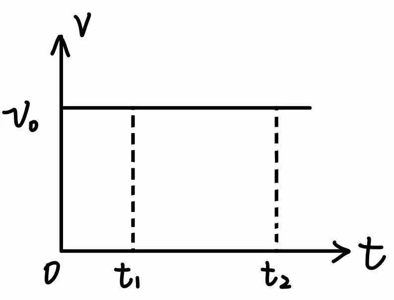
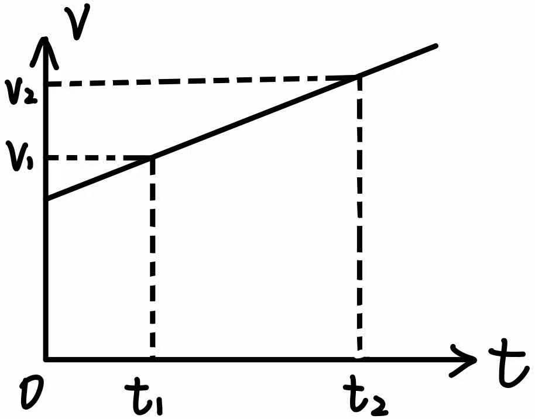
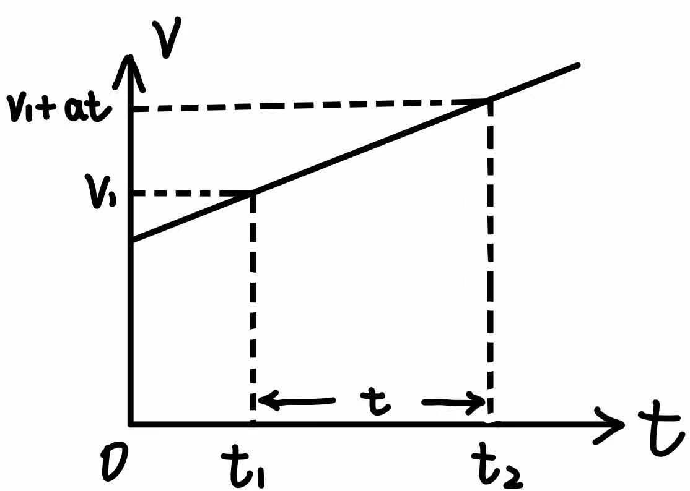
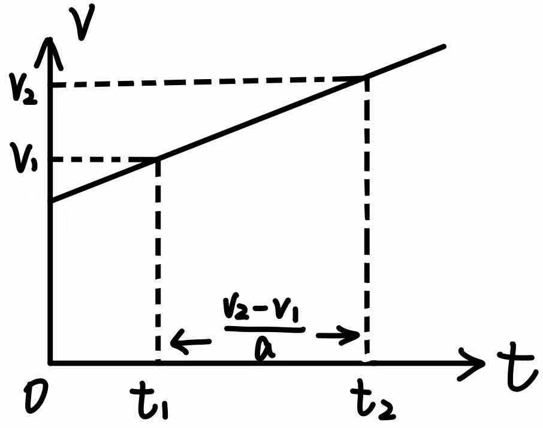
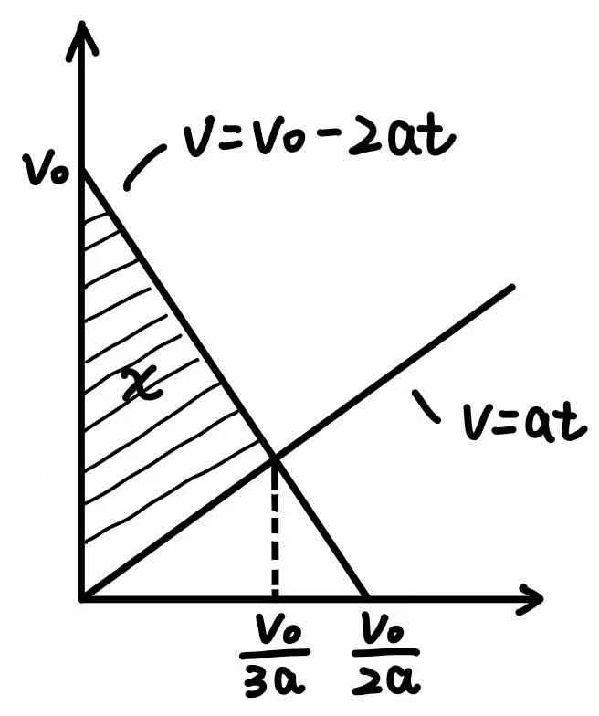

<!--more-->
<!-- more -->

# 基础概念

## 质点、参考系

1. **机械运动**：一个物体相对另一个物体的位置发生变化。这里的位置包含两层含义，一个是距离，一个是方向。机械运动可以分为：
   * 平动：刚体自身的质点之间不发生相对运动，只是整体的移动。（比如人走路）
     * 直线运动
     * 曲线运动
   * 转动：在整体运动的同时，刚体自身的质点也相对质心发生转动。（比如芭蕾舞）
   * （高中阶段只研究平动）
2. **质点**：
   1. 理想化模型，现实不存在
   2. 只有质量，没有大小
   3. 条件：相对性
3. **参考系**：就是参照物。一般是地面，或匀速直线运动的物体

## 位移、路程

1. **位移**：一个从起点指向终点的有向线段（矢量，有大小和方向）
2. **路程**：运动轨迹的长短（标量，有大小，无方向）

位移 $\vec{x}$ 与 路程 $s$ 的关系：$s \geq \vert \vec{x} \vert$，当且仅当单向直线运动时，等号成立。

判断题：当位移为 0 时，路程可能不为 0.

## 时间、时刻

1. 时间：时间轴上的某个区间（过程量）
2. 时刻：时间轴上的某个点（状态量）

在时间轴上标出： 
① 2s 初，2s 末 
② 2s 内 
③ 第 2s 内

## 速度、速率

1. 速度：
   * 意义：描述物体位置变化的快慢
   * 符号：$\vec{v}$（矢量）
   * 定义式：$\vec{v}=\dfrac{\Delta \vec{x}}{\Delta t}=\dfrac{\vec{x}_1 - \vec{x}_2}{t}$，方向与 $\Delta{x}$ 方向相同
2. 平均速度与瞬时速度
   * 平均速度：一段时间的速度
   * 瞬时速度：某个时刻的速度
3. 速率（瞬时速率）
   * 定义式：$v=\lim_{\Delta t \rightarrow 0} \dfrac{\Delta s}{\Delta t}$ 标量）
   * 速率就是生活中说的“速度”
4. 平均速率
   * 定义式：$v=\dfrac{\Delta s}{\Delta t}$

问：瞬时速度与瞬时速率哪个大？平均速度和平均速率哪个大？

## 加速度

1. 加速度：
   * 意义：描述运动速度变化的快慢
   * 符号：$\vec{a}$（矢量）
   * 定义式：$\vec{a}=\dfrac{\Delta \vec{v}}{\Delta t}$

判断：在直线运动中， 
① $a$ 与 $v$ 不同向，则是减速运动 
② $a$ 为负，则是减速运动 
 
判断：在运动过程中， 
① $a$ 与 $v$ 不同向，则是减速运动 
② $a$ 与 $v$ 不同向，则不是直线运动

# v-t 图

$v-t$ 图，即横轴是时间，纵轴是速度的图像。可以用来描述直线运动。合理使用 $v-t$ 图，可以帮助我们记忆公式，理清题目。本节将结合 $v-t$ 图介绍匀速直线运动与匀加速直线运动。

## 匀速直线运动

匀速直线运动的速度保持不变，所以 $v-t$ 图是一条水平线：

在研究匀速直线运动时，我们常常指定一个方向为正，另一个方向为负（并且不加矢量箭头）。从图中可以看出，速度 $v=v_0$ 为正，说明物体向正方向运动。

如果我们要求 $t_1$ 到 $t_2$ 这段时间内物体的位移，由初中知识可知：

$$
s=v_0\cdot (t_2-t_1)
$$

观察图像可以发现，$v_0\cdot (t_2-t_1)$ 恰好就是图中间矩形的面积，更准确的描述是：$t_1$ 到 $t_2$ 之间，速度与时间轴围成的面积。也就是说，我们可以把求位移转换成求面积。

## 匀加速直线运动

匀加速直线运动的速度以恒定的加速度增加或减少，所以 $v-t$ 图是一条斜向上或斜向下的直线：

我们考虑 $t_1$ 到 $t_2$ 的位移，也就是中间那个梯形

$$
s = \frac{1}{2}\cdot(v_1+v_2)\cdot (t_2-t_1)
$$

注意到 $v_1$ 经过了 $(t_2-t_1)$ 时长的加速后变为了 $v_2$，也就是说：

$$
v_2 = v_1+a\cdot (t_2-t_1)
$$

我们将 $v_2$ 代入位移的表达式中：

$$
\begin{aligned}
  s &= \frac{1}{2}\cdot [v_1+v_1+a\cdot (t_2-t_1)] \cdot (t_2-t_1)\\
    &=\frac{1}{2}\cdot [2v_1+a\cdot (t_2-t_1)] \cdot (t_2-t_1)\\
    &=v_1(t_2-t_1)+\frac{1}{2}a\cdot (t_2-t_1)^2
\end{aligned}
$$

为了好看，我们一般定义 $t=t_2-t_1$，那么位移的表达式为：

$$
s=v_1 t + \frac{1}{2} a t^2
$$

我们可以结合下图来记忆：

我们也可以换种说法，从 $v_1$ 加速到 $v_2$ 所需的时间为：$t_2-t_1=\dfrac{v_2-v_1}{a}$，那么把 $t$ 代入第一个位移公式：

$$
\begin{aligned}
  s &= \frac{1}{2}\cdot(v_1+v_2)\cdot (t_2-t_1)\\
  &=\frac{1}{2} \cdot \frac{(v_2+v_1)(v_2-v_1)}{a}\\
  &=\frac{v_2^2-v_1^2}{2a}
\end{aligned}\\
整理后有 v_2^2-v_1^2=2as
$$

我们可以结合下图来记忆：

总结一下：

|条件|公式|
|---|----|
|已知初速度、加速度、时间 不知道末速度|$s=v_1 t + \frac{1}{2} a t^2$|
|已知初速度、加速度、末速度 不知道时间|$s=\dfrac{v_2^2-v_1^2}{2a}$|

问：仿照上面的过程，推导： 
① 已知初速度、时间、末速度，不知道时间 
② 已知末速度、加速度、时间，不知道初速度

注：一般来说，初速度用 $v_0$ 来表示。但有时候可能要求多段匀变速直线运动的位移，所以建议把 $t_1$ 时刻的速度设为 $v_1$，把 $t_2$ 时刻的速度设为 $v_2$ … 以此类推。

# 特殊的直线运动

## 自由落体运动

1. 自由落体运动指的是：只在重力作用下，从静止开始的自由下落
2. 本质：初速度为 0 的匀加速直线运动
3. 重力加速度：$g \approx 9.8 \, {\rm m/s^2} \approx 10 \, {\rm m/s^2}$
4. 公式：
   $$
   \begin{cases}
     v=gt\\
     h=\frac{1}{2} gt^2\\
     v^2=2gh
   \end{cases}
   $$

问：“反应尺”可以用来测量反应时间（如图），开始时，你的手在 0 刻度的位置，当同学放开尺子后，你抓住的位置在 $16.2 \, {\rm cm}$ 处。问反应时间为多长？（$g$ 取 $10 \, {\rm m/s^2}$） 

问：小明将小球以 $1\,{\rm m/s}$ 的速度竖直向上抛，问需要多长时间到达最高点？

扩展：铁球和羽毛哪个落得快？（伽利略的比萨斜塔实验）





## 追及运动

A、B 相距 $x$，A 做初速度为 $v_0$，加速度大小为 $2a$ 的匀减速直线运动。B 同时做初速度为零，加速度为 $a$ 的匀加速直线运动，A、B 运动方向相同，要使 A、B 不相撞，求 A 的初速度 $v_0$ 应满足什么条件？

解法一：临界条件法 
刚好相遇时：$v_A=v_B\tag{1}$ 
A 减速：$v_A=v_0-2at\tag{2}$ 
B 加速：$v_B=at\tag{3}$ 
两者路程满足：$v_0t-\frac{1}{2}\cdot 2a t^2 = x+\frac{1}{2}at^2 \tag{4}$ 
由上四式，解得：$v_0=\sqrt{6ax}$ 
故 $v_0$ 满足 $v_0 < \sqrt{6ax}$

解法二：函数法 
假如相遇：$v_0t-\frac{1}{2}\cdot 2a t^2 = x+\frac{1}{2}at^2$ 
化简得：$\frac{3}{2}at^2-v_0t+x=0$ 
要不相撞，即 $t$ 无解，$\Delta<0$ 
$$
(-v_0)^2-4\cdot \frac{3}{2}ax< 0
$$ 
解得：$v_0< \sqrt{6ax}$

解法三：图像法 
由图可知：$\frac{1}{2}\cdot v_0 \cdot \frac{v_0}{3a}< x$ 
解得：$v_0<\sqrt{6ax}$ 

解法四：相对运动法（慎用） 
以 B 为参考系，A 的加速度为 $a'=2a+a=3a$ 
A 减速到零：$v_0^2=2a'x$ 
解得：$v_0=\sqrt{6ax}$ 
故：$v_0\leq \sqrt{6 a x}$

## 小车与打点计时器

注意几点：

1. 如何平衡摩擦力？
2. 如何求某点的瞬时速度？
3. 如何求加速度？（如何减小误差？）

<iframe src="//player.bilibili.com/player.html?aid=40478816&bvid=BV1ct411W7Jc&cid=172818789&page=21" scrolling="no" border="0" frameborder="no" framespacing="0" allowfullscreen="true"> </iframe>

# 运动的合成与分解

就是矢量的合成与分解。

规律：

* $t\rightarrow 等时性$ 
* $v,s,a \rightarrow 矢量合成\rightarrow 独立、等效、同一性$

请自行去看 [百度文库：小船渡河](https://wenku.baidu.com/view/8a8e343610661ed9ad51f3a4.html)

## 抛体运动

抛体运动包括：

* 平抛
  * 水平方向上：匀速直线运动
  * 竖直方向上：初速度为 0 的匀加速直线运动（自由落体）
* 斜抛
  * 水平方向上：匀速直线运动
  * 竖直方向上：初速度不为 0 的匀加速直线运动

以平抛为例，我们只需要列对应方向上的方程：

$$
\begin{aligned}
&水平:
\begin{cases}
   v_x = v_0\\
   x = v_0 t
\end{cases}\\
&竖直:
\begin{cases}
   v_y = gt\\
   y = \frac{1}{2} gt^2
\end{cases}
\end{aligned}
$$

注意这两个方程共享着一个变量 $t$

除此之外，还有一个比较有趣的结论。如果设 $\tan \alpha = \dfrac{y}{x}$，$tan \beta = \dfrac{v_y}{v_x}$，那么：

$$
\tan \alpha = \frac{y}{x} = \frac{\frac{1}{2} gt^2}{v_0 t}=\frac{\frac{1}{2} gt}{v_0}\\
tan \beta = \dfrac{v_y}{v_x}=\frac{gt}{v_0}\\
\Rightarrow \tan\alpha = \frac{1}{2}\tan\beta
$$

这个结论经常用在[平抛与斜面结合](https://zhuanlan.zhihu.com/p/90076323)的题目

多选题：如图所示，在斜面上 A 点，以水平速度 $v_0$ 抛出一个小球，不计空气阻力，它第一次落地的水平距离为 $x_1$；若将此球改用 $2v_0$ 水平速度抛出，第一次落地的水平距离为 $x_2$。则 $x_1:x_2$ 可能为： 
A. $1:2$ &emsp;B. $1:3$&emsp;C. $1:4$&emsp;D. $1:5$

