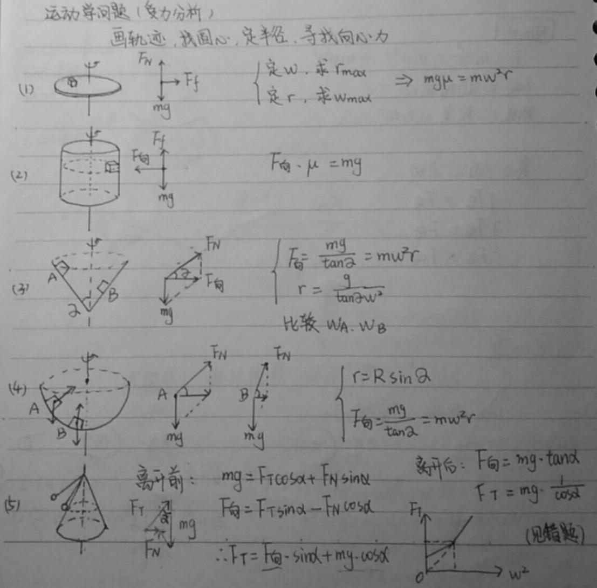
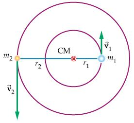

<!--more-->
<!-- more -->

$$
\begin{align*}
\newcommand{\dif}{\mathop{}\!\mathrm{d}}
\newcommand{\belowarrow}[1]{\mathop{#1}\limits_{\uparrow}}
\newcommand{\bd}{\boldsymbol}
\newcommand{\L}{\mathscr{L}}
\newcommand{\red}{\color{red}}
\newcommand{\blue}{\color{blue}}
\newcommand{\xleftrightarrow}[1]{\stackrel{#1}{\longleftrightarrow}}
\end{align*}
$$

# 牛顿三定律

## 第一定律

历史：

* 亚里士多德：力是维持物体运动的原因
* 伽利略：理想斜面实验（事实→理想）

牛顿第一定律：无外力时，一切物体总保持……或……状态（不是实验定律）

理解：

* 一切物体具有惯性
* 力是改变物体运动状态的原因
  * 运动状态（速度）包括：大小、方向

## 第二定律

牛顿第二定律：$a=\dfrac{F}{m}$

理解：

* $F$ 是因，$a$ 是果
* 矢量性、同一性、瞬时性

## 第三定律

牛顿第三定律：相互作用力（两个物体、等大、反向、共线）

理解：

* 异物性（无法抵消）
* 同时性
* 同性质
* 任何情况都成立

与平衡力的区别：

||作用力|平衡力|
|--|---|-----|
|作用物体个数|2个|同一个|
|性质|相同|可不同|
|关系|依存|不依存|

# 圆周运动

## 概念

* 周期 $T$，单位 ${\rm s}$
* 转速 $n$，单位 ${\rm r/s}$
* 频率 $f$，单位 ${\rm Hz}$
* 三者的关系：$T=\dfrac{1}{f}$，$f=n$

* 线速度 $v=\dfrac{2\pi r}{T}$，单位 ${\rm m/s}$
* 角速度 $\omega = \dfrac{2\pi}{T}$，单位 ${\rm rad/s}$
* 二者的关系：$v=\omega r$

* 向心加速度：$a=\dfrac{v^2}{r}=\omega^2 r = \omega v$

如果想知道向心加速度是怎么推导出来的，可以去看：[知乎：向心力加速度公式 a=v²/r 是怎么推导出来的（要详细过程）？](https://www.zhihu.com/question/273429434)，我这里给出一种简单的推导方式：

已知 $v=\omega r$，对两边求导，有：

$$
\frac{\Delta v}{\Delta t} = \omega \frac{\Delta r}{\Delta t}\\
\Rightarrow a = \omega v
$$

简单解释一下，加速度指的是速度的变化快慢，如果在 $\Delta t$ 内，速度的变化了 $\Delta v$，那么加速度就是 $a=\dfrac{\Delta v}{\Delta t}$。而在 $\Delta t$ 内，矢量 $r$ 转动了一个很小的距离 $\Delta r$，这个距离就是 $v \Delta t$，所以 $v=\dfrac{\Delta r}{\Delta t}$

扩展：角速度是矢量还是标量？

## 向心力

* 定义：物体做匀速圆周运动所受的合外力
* 大小：$F= ma = m \dfrac{v^2}{r}=m\omega^2 r$
* 方向：指向圆心，垂直于速度
* 效果：改变 $v$ 的方向，不改变 $v$ 的大小

问：下面三种情况中，哪个是离心运动，哪个是近心运动？ 
① $F_合 > F_向$ 
② $F_合 = F_向$ 
③ $F_合 < F_向$

# 万有引力

历史：

* 地心说
* 日心说（哥白尼）
* 第谷
* 开普勒（总结第谷的资料）
  * 开普勒三定律
    1. 轨道：椭圆
    2. 面积：时间相同，扫过的面积相同（只针对同一颗行星）
    3. 周期：$\dfrac{a^3}{T^2}=K$（$a$ 是半长轴，$K$ 与中心天体的质量有关）
* 牛顿：万有引力定律（如下）

$$
F = G\frac{m_1m_2}{r^2}\\
引力常数\, G=6.67\times 10^{-11} \,{\rm N\cdot m^2/kg^2}
$$

## 卫星的发射

* 第一宇宙速度 $v_1=7.9 \,{\rm km/s}$ 卫星发射的最小速度
* 第二宇宙速度 $v_2=11.2 \,{\rm km/s}$ 卫星挣脱地球引力的最小速度
* 第三宇宙速度 $v_3=16.7 \,{\rm km/s}$ 卫星挣脱太阳引力的最小速度

这里我们只需要掌握第一宇宙速度的运算方法（两种都可以）：

1. 万有引力提供向心力：$G \dfrac{mM}{r^2}=m\dfrac{v_1^2}{r}$ $\Rightarrow v_1 = \sqrt{\dfrac{GM}{r}}$
2. 重力提供向心力：$mg=m\dfrac{v_1^2}{r}$ $\Rightarrow v_1=\sqrt{gr}$

我们可以稍微验算一下：

$$
\begin{aligned}
  v_1 &= \sqrt{\dfrac{6.67\times 10^{-11}\times 5.97\times 10^{24}}{6.36\times10^6}}=7.913\times 10^3 \,{\rm m/s}\\
  v_1 &= \sqrt{10\times 6.36\times 10^6}=7.975\times10^3 \,{\rm m/s}
\end{aligned}
$$

## 卫星的运行

$$
G\frac{mM}{r^2}=
\begin{cases}
  ma \rightarrow a=\frac{GM}{r^2}\\
  m\frac{v^2}{r} \rightarrow v=\sqrt{\dfrac{GM}{r}}\\
  m\omega^2 r\rightarrow \omega=\sqrt{\dfrac{GM}{r^3}}\\
  m \left(\frac{2\pi}{T}\right)\rightarrow T = 2\pi \sqrt{\dfrac{r^3}{GM}}
\end{cases}
\Rightarrow 
\begin{cases}
  a \propto \dfrac{1}{r^2}\\
  v \propto \dfrac{1}{\sqrt{r}}\\
  \omega \propto \dfrac{1}{\sqrt{r^3}}\\
  T\propto \sqrt{r^3}
\end{cases}\\
总而言之就是：越高越慢
$$

注：

1. $r,a,v,\omega,T$ 与 $m$ 无关，且其中任意一个确定，其他也确定。
2. 同一卫星，半径越大，动能越小，势能越大，机械能越大。

有一个卫星比较特殊，叫“同步卫星”，关于同步卫星只需要记住三点：

1. 周期一定：24h
2. 轨道一定：赤道上空
3. 方向一定：地球自转方向

# 天体质量与密度

公式中，$\blue{蓝色的}$是题目给出的条件，$\red{红色的}$是要求的量，常数和无关紧要的量就还是黑色。

## 质量

1. 着地法：$m \blue{g} = G \dfrac{m\red{M}}{\blue{R}^2}$ $\rightarrow \red{M} = \dfrac{\blue{gR}^2}{G}$
2. 环绕法：
   1. $G\dfrac{m\red{M}}{\blue{r}^2}=m(\dfrac{2 \pi}{\blue{T}})^2\blue{r}$ $\rightarrow \red{M}=\dfrac{4\pi^2 \blue{r}^3}{G \blue{T}^2}$
   2. $G\dfrac{m\red{M}}{\blue{r}^2}=m \dfrac{\blue{m}}{\blue{r}}$ $\rightarrow \red{M}=\dfrac{\blue{r}\blue{v}^2}{G}$
   3. $G\dfrac{m\red{M}}{r^2}=m\dfrac{\blue{v}^2}{r}=m(\dfrac{2\pi}{\blue{T}})^2r$ $\rightarrow \red{M}=\dfrac{\blue{Tv}^3}{2\pi G^2}$

## 密度

1. 着地法：
   $$
   \begin{aligned}
     m \blue{g} &= G\dfrac{\red{M}m}{\blue{R}^2}\\
     \red{M}&=\red{\rho}\cdot \frac{4}{3} \pi \blue{R}^3
   \end{aligned} \rightarrow
   \red{\rho} = \frac{3 \blue{g}}{4 \pi G \blue{R}}
   $$
2. 近地环绕法：
   $$
   \begin{aligned}
     G\dfrac{\red{M}m}{r^2} &= m (\dfrac{2\pi}{\blue{T}})^2 r\\
     \red{M}&=\red{\rho}\cdot \frac{4}{3} \pi R^3
   \end{aligned} \xrightarrow{r\approx R}
   \red{\rho} = \frac{3 \pi}{G\blue{T}^2} 
   $$

还有一些比较有趣的方法，比如角度法、双重力法、同步卫星观察法等，这些可以在做题时留意一下。

## 双星问题

如图所示，两颗星围绕着公共点做周期相同的匀速圆周运动，周期为 $T$，两星之间的距离为 $r$，求 $m_1+m_2$

对 $m_1$：

$$
G \frac{m_1m_2}{r} = m_1 (\frac{2\pi}{T})^2 r_1\\
m_2 = \frac{4\pi^2 r^2}{GT^2} r_1
$$

对 $m_2$：

$$
G \frac{m_1m_2}{r} = m_2 (\frac{2\pi}{T})^2 r_2\\
m_1 = \frac{4\pi^2 r^2}{GT^2} r_2
$$

两者相加：

$$
m_1+m_2=\frac{4\pi^2 r^2}{GT^2} (r_1+r_2)=\frac{4\pi^2 r^3}{GT^2}
$$

推论：

$$
m_1r_1=m_2r_2 \rightarrow r \propto \frac{1}{m}\\
\frac{r^3}{T^2} \propto m_1+m_2 \rightarrow 满足开三\\
T=2\pi \sqrt{\dfrac{r^3}{G(m_1+m_2)}}
$$