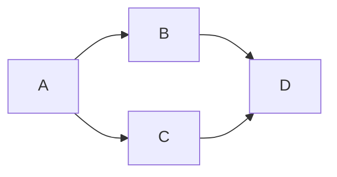

> 请写作者务必按照指定格式写作，以获得更好的效果

<!--more-->

# 文件名命名

## 主页文章

主页文章即进入 SCUTEEE 首先看到的文章。主页文章存放在 *_post* 文件夹，并按照以下格式命名：

```
年-月-日-标题.md
```

其中，月 日 必须是两位数，标题必须用英语且小写，用 `-` 隔开单词。下面是合法的文件名的例子：

```
2011-12-31-scuteee-is-awesome.md
2012-09-12-how-to-write-a-blog.md
```

## 主题文章

主题文章是指从导航栏进入的，按一定主题分类的一系列文章。主题文章存放在 *_主题名* 文件夹内，并按照以下标准命名：

1. 格式必须是`序号-标题.md`，如 `1.1-the-linear-algebra.md`
2. 每个系列必须有一篇文章介绍主题，命名为 `0-主题-index.md`

# YAML 头信息

所有博客文章顶部必须有一段 YAML 头信息(YAML front-matter)，相当于文章的基本设置。

## 主页文章

请在文章开头将这一段复制粘贴进去，并填入对应信息（没有注释的均不要更改，**注意冒号后必须要有空格**）：


---
layout: article
title: 标题 #文章标题
tags: [tag1, tag2, tag3] #文章标签
author: #作者名#必须先与管理员沟通
show_author_profile: false #是否显示作者
mathjax: false #是否开启 LaTeX 输入
mermaid: false #是否开启 mermaid 输入
chart: false #是否开启chart输入
mathjax_autoNumber: false #是否开启 LaTeX 自动编号
mode: normal
key: courses-index #文章唯一标识符
pageview: false #是否开启阅读量统计#要设置 key
comment: true #是否开启评论
show_edit_on_github: false
show_date: true #是否显示文章日期
aside:
  toc: true #是否显示目录
---


下面对上面部分内容进行进一步补充：

### title 标题

- 应当体现文章的目的或论题，最好在 20 个字以内。
- 应当能让读者轻松搜索到
- 中文与英文之间应当用空格隔开。（这点同样适用于文章内容）

### tags 标签

* 应当是与文章内容相关的名词；
* 应当至少包含一个关于文章类型的名称，从以下名称中选择：
    * `项目` 由自己开发的软硬件，或别人的开源软硬件
    * `教程` 如何搭建、配置、使用软硬件
    * `理论` 数学性、原理性的论文
    * `生活` 闲聊、吐槽之类与理工无关的
    * `其他` 无法被上面包括的
* 应当优先采用已有标签；
* 应当适当细分，比如 `C++` 好于 `编程`，`stm32` 好于 `stm32f103`；
* 应当符合书面规范，而不应口语化，比如 `模拟电子` 好于 `模电`；
* 应当优先采用中文，比如 `树莓派` 好于 `Raspberry Pi`；
* 特殊的，如果文章内包含大量图片，应当加入 `多图预警`；

### author 作者

作者必须先提供基本信息，让管理员写入 `_data/author.yml`，这样才能正常显示。需要提供的信息包括：

1. 名称
2. 头像图片的 url
3. 一句介绍自己的话
4. 邮箱
5. 社交软件的个人主页链接（微博、知乎、github）


## 主题文章

主题文章需要在主页文章的 YAML 信息的基础上加入以下这些：

```
---
nav_key: courses #导航栏对应的栏目
permalink: /courses/index #指定生成的链接
sidebar:
  nav: 系列 #系列文章目录
---
```

具体的用法需要由管理员亲自培训，故在此不详述。


## 封面图片

如果想要美化文章标题，可以加上封面图片

```
---
header:
  theme: dark
article_header:
  type: overlay
  theme: dark
  background_color: '#ffffff'
  background_image:
    src: 图片链接 #封面图片
    gradient: 'linear-gradient(0deg, rgba(0, 0, 0 , .5), rgba(0, 0, 0, .5))'
---
```


# 文章

## 摘要

请用 `<!--more-->` 将摘要和正文分开，要单独占一行。

**注意：无论是否有摘要，都要加上`<!--more-->`，否则会默认取前 350 个字作为摘要。**

## 小标题

有很多人都推荐从 `##` 开始写小标题，而把 `#` 作为全文的标题。但由于我们这里已经在在 YAML 头信息中说明了全文标题，没必要从 `#` 开始。而且我对 `#` 作了特别处理，具体效果参考上面的小标题 “文章”。所以我更加推荐从 `#` 开始写。

## Markdown

服务器采用 kramdown 进行渲染。kramdown 是 markdown 的超集，在基本 markdown 语法上加入了特殊语法。下面列举几个：

### 提示

```markdown
Success Text.
{:.success}
```

Success Text. 
{:.success}

```markdown
Info Text.
{:.info}
```

Info Text.
{:.info}

```markdown
Warning Text.
{:.warning}
```

Warning Text.
{:.warning}

```markdown
Error Text.
{:.error}
```

Error Text.
{:.error}

上述只是简便写法，用于在快速记笔记时使用，缺点是不支持 LaTeX。要支持 LaTeX 可以用下面写法：

```
<p class="success">
Success Text.（LaTeX Supported：$E=mc^2$）
</p>
```

<p class="success">
Success Text.（LaTeX Supported：$E=mc^2$）
</p>

另外，如果你希望能在本地预览这个样式，可以将下列代码添加到 css样式表（某些编辑器可能不支持，我的 VS Code+Markdown Preview Enhanced 支持）：

<details>

p.success {
  padding: 0.5rem 1rem;
  background-color: rgba(#52c41a, 0.1);
  border: 1px solid #52c41a;
  border-radius: 0.4rem;
}

p.info {
  padding: 0.5rem 1rem;
  background-color: rgba(#1890ff, 0.1);
  border: 1px solid #1890ff;
  border-radius: 0.4rem;
}

p.warning {
  padding: 0.5rem 1rem;
  background-color: rgba(#fa8c16, 0.1);
  border: 1px solid #fa8c16;
  border-radius: 0.4rem;
}

p.error {
  padding: 0.5rem 1rem;
  background-color: rgba(#f5222d, 0.1);
  border: 1px solid #f5222d;
  border-radius: 0.4rem;
}

</details>

### 标签

| 示例                 | markdown                 |
| -------------------- | ------------------------ |
| `success`{:.success} | <code>&#96;success&#96;{:.success}</code>   |
| `info`{:.info}       | <code>&#96;info&#96;{:.info}</code>        |
| `warning`{:.warning} | <code>&#96;warning&#96;{:.warning}</code>  |
| `error`{:.error}     | <code>&#96;error&#96;{:.error}</code>      |

同样的，你也可以用 `<code class= "success">success</code>` 来代替。这里同样给出css

<details>

code.success {
  color: #fff;
  background-color: #52c41a;
}

code.info {
  color: #fff;
  background-color: #1890ff;
}

code.warning {
  color: #fff;
  background-color: #fa8c16;
}

code.error {
  color: #fff;
  background-color: #f5222d;
}

</details>

### 注释

```markdown
footnote[^1]

[^1]: Some *crazy* footnote definition.
```
footnote[^1]

[^1]: Some *crazy* footnote definition.

### 内容折叠


<details>
<summary>展开查看</summary>
测试 $\LaTeX$

%highlight python linenos %}
print("test")
%endhighlight%}

$$
E=mc^2
$$
</details>


<details>
<summary>展开查看</summary>
测试 $\LaTeX$


print("test")


$$
E=mc^2
$$
</details>

内容折叠中只能使用 <code>highlight python linenos</code> 形式的代码片段（后面会说明这种片段的语法）

## 图片

### 存放位置

图片请尽量采用可以从互联网上找到的图片，若需要用本地的图片，有如下解决方法：

---

`图床`{:.success} 

图床和云盘差不多，区别在于图床会提供 url，适合外部引用。网上有很多免费的图床服务：

* [路过图床](https://imgchr.com/) （免费，推荐）
* [SM.MS](https://sm.ms)（免费，推荐，有丢失可能）
* [七牛云](https://portal.qiniu.com/) （免费，一般）
* [聚合图床](https://www.superbed.cn/) （免费，一般）

---

`Github`{:.success} 

Github 可以新建个公共仓库放图片，必须是公共仓库。

---

`微博、知乎`{:.success} 

可以在微博、知乎上新建博文、专栏文章，然后再将图片链接拷贝下来。

---

<center></center>

由于以上都不是保存在自己的服务器中，所以有丢失的风险。建议将图片上传到图床后，再保存一份在一个文件夹中，交给管理员，管理员会把这些文件放在服务器上作为备份。

另外，图片的描述信息尽可能地写清楚一点（如果是书本的截图，标清楚是哪一页哪张图），保证即使图片丢失也能找到相似图片代替。


### 图片排版

如果采用Markdown的格式来插入图片，则会默认靠左对齐，比如说：

```markdown

```


如果你觉得图片太大或太小，可以采用 html：

```html

```


如果想要图片居中，可以采用 html：

```html
<center>

</center>
```

<center>

</center>

如果想要图片在右，并且文字包围图片，可以用：

```html

```


> 波普艺术 一种主要源于商业美术形式的艺术风格（亦称新写实主义和新达达），其特点是将大众文化的一些细节，如连环画、快餐及印有商标的包装进行放大复制。波普艺术于20世纪50年代初期萌发于英国，50年代中期鼎盛于美国，后期在纽约发展起来，此时它所反对的抽象表现主义正处于最后的繁荣时期。60年代中期，波普艺术代替了抽象表现主义而成为主流的前卫艺术。在60年代后期，波普艺术开始让位于极简主义艺术（MINIMAL ART）和硬边画（HARD-EDGE PAINTING）。  波普艺术主要方面是新时期艺术家将商业艺术和近现代艺术联合在一起的一种表达形式

### 特大图片

为了加快加载速度，要求本地图片尽可能先压缩后再上传，并且整个页面的图片最好不要超过 500k，若实在需要放大图，可以采用如下方法：

```html
<a href="/assets/images/tenor.gif" data-lightbox="image" data-title="说明文字">示例</a>
```
<a href="/assets/images/tenor.gif" data-lightbox="image" data-title="说明文字">示例</a>

<!--https://media.tenor.com/images/28e90ce9423d3c07bd35fdd0e27bd5f7/tenor.gif-->


## LaTeX

使用 MathJax 进行渲染。

行内使用 $\LaTeX$：<code>$\LaTeX$</code>

行外使用 $\LaTeX$：（必须前后空一行）

```latex
%空一行！！！
$$
\rm{sgn} \; x=
\begin{cases}
0 ,\quad x\leq 0\\
1 ,\quad x  >  0
\end{cases}
$$
%空一行！！！
```

$$
\rm{sgn} \; x=
\begin{cases}
0 ,\quad x\leq 0\\
1 ,\quad x  >  0
\end{cases}
$$

更多关于 LaTeX 的说明，请看 [mathjax-basic-tutorial-and-quick-reference](https://math.meta.stackexchange.com/questions/5020/mathjax-basic-tutorial-and-quick-reference)

## 媒体

### 网易云音乐

id 即歌曲网页链接的最后一串数字。注意，并不是所有的歌都可以在外部访问的，你需要去网页版网易云，点进歌曲后，点击封面下面的“生成外链播放器”


```html
<div></div>
```


<div></div>

### 哔哩哔哩

id 即 AV 号，如果想要用 BV 号，需要复制 iframe 代码（这个我以后改一下相关代码）。


```html
<div></div>
```


<div></div>

## 代码

目前默认的代码是没有行号的，比如：

```markdown
​```python
print("Hello, world!")
​```
```

```python
print("Hello, world!")
```

想要有行号，可以用下面的方法：


```

a = "Hello, world!"
print(a)

```



a = "Hello, world!"
print(a)


这种方法的缺点是不支持在本地预览，所以建议较短的代码用一般 Markdown 语法即可

## 图表

可以使用 mermaid 或 flowchart，写法可以去参考官网：[mermaid-js.github.io](https://mermaid-js.github.io/mermaid/#/) 和 [flowchart.js.org](http://flowchart.js.org/)



```flow
st=>start: Start:>http://www.google.com[blank]
e=>end:>http://www.google.com
op1=>operation: My Operation
sub1=>subroutine: My Subroutine
cond=>condition: Yes
or No?:>http://www.google.com
io=>inputoutput: catch something...
para=>parallel: parallel tasks

st->op1->cond
cond(yes)->io->e
cond(no)->para
para(path1, bottom)->sub1(right)->op1
para(path2, top)->op1
```

## 文章附件

除了 .md 文件外，还有其他一些文件与文章有关，比如图片、代码等。你可以建立对应的 `images`、`code`、`assets` 文件夹来存放这些文件。然后把文件夹传到服务器上，这样读者可以从服务器下载对应的文件。

# 规范


<details>
<summary>Markdown 语法「应当」采用如下规则：</summary>

<ul>
<li> 标题、段落、列表、代码、LaTeX 等段元素之间必须有一个空行</li>
<li> 标题可以从 「#」 开始，也可以从 「##」开始</li>
<li> 其他请遵循 <a href="https://guides.github.com/pdfs/markdown-cheatsheet-online.pdf">Github Flavored Markdown</a></li>
</ul>
<hr>
</details>

<details>
<summary>中英文混排「应当」采用如下规则：</summary>

<ul>
<li> 英文和数字使用半角字符</li>
<li> 中文文字之间不加空格</li>
<li> 中文文字与英文、阿拉伯数字及 @ # $ % ^ & * . ( ) 等符号之间加空格</li>
<li> 中文标点之间不加空格</li>
<li> 中文标点与前后字符（无论全角或半角）之间不加空格</li>
<li> 如果括号内有中文，则使用中文括号</li>
<li> 如果括号中的内容全部都是英文，则使用半角英文括号</li>
<li> 当半角符号 / 表示「或者」之意时，与前后的字符之间均不加空格</li>
<li> 其它具体例子推荐 <a href="https://github.com/mzlogin/chinese-copywriting-guidelines">中文文案排版指北</a></li>
</ul>
<hr>
</details>

<details>
<summary>中文符号「应当」使用如下写法：</summary>

<ul>
<li> 用直角引号（「」）代替双引号（“”），不同输入法的具体设置方法请 <a href="http://www.zhihu.com/question/19755746">参考这里</a>，对于微软拼音，可以在「设置」-「词库和自学习」-「添加或编辑自定义短语」设置</li>
<li> 省略号使用「……」，而「。。。」仅用于表示停顿</li>
<li> 其它可以参考 <a href="http://www.zhihu.com/question/20414919">知乎规范</a></li>
</ul>
<hr>
</details>

<details>
<summary>表达方式，「应当」遵循<a href="http://www.sciwriting.cn/download/elos.pdf">《The Element of Style》</a>：</summary>

<ul>
<li> 使段落成为文章的单元：一个段落只表达一个主题</li>
<li> 通常在每一段落开始要点题，在段落结尾要扣题</li>
<li> 使用主动语态</li>
<li> 陈述句中使用肯定说法</li>
<li> 删除不必要的词</li>
<li> 避免连续使用松散的句子</li>
<li> 使用相同的结构表达并列的意思</li>
<li> 将相关的词放在一起</li>
<li> 在总结中，要用同一种时态（这里指英文中的时态，中文不适用，所以可以不理会）</li>
<li> 将强调的词放在句末</li>
</ul>
<hr>
</details>

> 好消息~ 好消息~ 因为使用了 [pangu.js](https://wujunze.com/2019/2019-08-29-pangu-js/ "如何使用？")，中英之间就算不加空格也没所谓了，会自动帮你加的~ ✌

# 更多

## 如何配置写作环境

&emsp;&emsp;我常用的编辑软件有两个：VS Code 和 Typora，下面说说我的配置方法：

`VS Code`{:.success}

先下载插件：Markdown Preview Enhanced，然后在设置中，将 Math Rendering Option 改为 “MathJax”，然后按 `Ctrl`+`Shift`+`P`，在弹出框中输入 Markdown Preview Enhanced: Customize Css，然后补充以下扩展 css：

<details>
<summary>扩展 css</summary>

p.success {
  padding: 0.5rem 1rem;
  background-color: rgba(#52c41a, 0.1);
  border: 1px solid #52c41a;
  border-radius: 0.4rem;
}

p.info {
  padding: 0.5rem 1rem;
  background-color: rgba(#1890ff, 0.1);
  border: 1px solid #1890ff;
  border-radius: 0.4rem;
}

p.warning {
  padding: 0.5rem 1rem;
  background-color: rgba(#fa8c16, 0.1);
  border: 1px solid #fa8c16;
  border-radius: 0.4rem;
}

p.error {
  padding: 0.5rem 1rem;
  background-color: rgba(#f5222d, 0.1);
  border: 1px solid #f5222d;
  border-radius: 0.4rem;
}

code.success {
  color: #fff;
  background-color: #52c41a;
}

code.info {
  color: #fff;
  background-color: #1890ff;
}

code.warning {
  color: #fff;
  background-color: #fa8c16;
}

code.error {
  color: #fff;
  background-color: #f5222d;
}

</details>

`Typora`{:.success}

在菜单-偏好设置-Markdown里，勾选 “Markdown 扩展语法” 中的 “内联公式”。

打开菜单-主题，然后点击“打开主题文件夹”，然后在你使用的主题 css 文件末尾加入上面的扩展 css.

注意 Typora 有个比较坑的就是它不会在 `$$...$$` 前后空一行，在网页中显示时会与前后的文字连在一起，所以需要手动空一行。

## 奇淫技巧

`LaTeX`{:.success}

我经常会在笔记中用到某些常用的 LaTeX 语法，所以我设置了几个缩写：

```latex
\begin{align*}
\newcommand{\dif}{\mathop{}\!\mathrm{d}}\\ %微分
\newcommand{\p}{\partial}\\ %偏微分
\newcommand{\bd}{\boldsymbol}\\ %加粗
\newcommand{\db}[1]{\dot{\boldsymbol{#1}}} %加粗加点（物理常用）
\newcommand{\belowarrow}[1]{\mathop{#1}\limits_{\uparrow}} %字下面加上箭头（dsp常用）
\newcommand{\xleftrightarrow}[1]{\stackrel{#1}{\longleftrightarrow}} %左右箭头，上面有字（用于说明各种变换）
\end{align*}
```

你也可以用 \newcommand 定义自己的缩写。用 align* 包围是为了避免编号。

`其它`{:.success}

* [markdown 如何在 <code>&#96;&#96;</code> 内转义 &#96; 符号?](https://segmentfault.com/q/1010000010302143)

> 由于 kramdowm 比较复杂，有可能出现很多奇奇怪怪的问题。我在写这篇文章的时候就有一个bug（留意最长那段YAML，我标注的是 HTML）。我建议是尽量只用原生 Markdown 语法和简单的 LaTeX