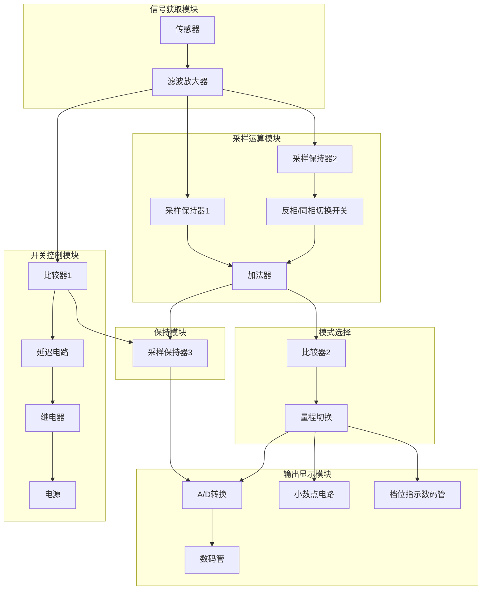
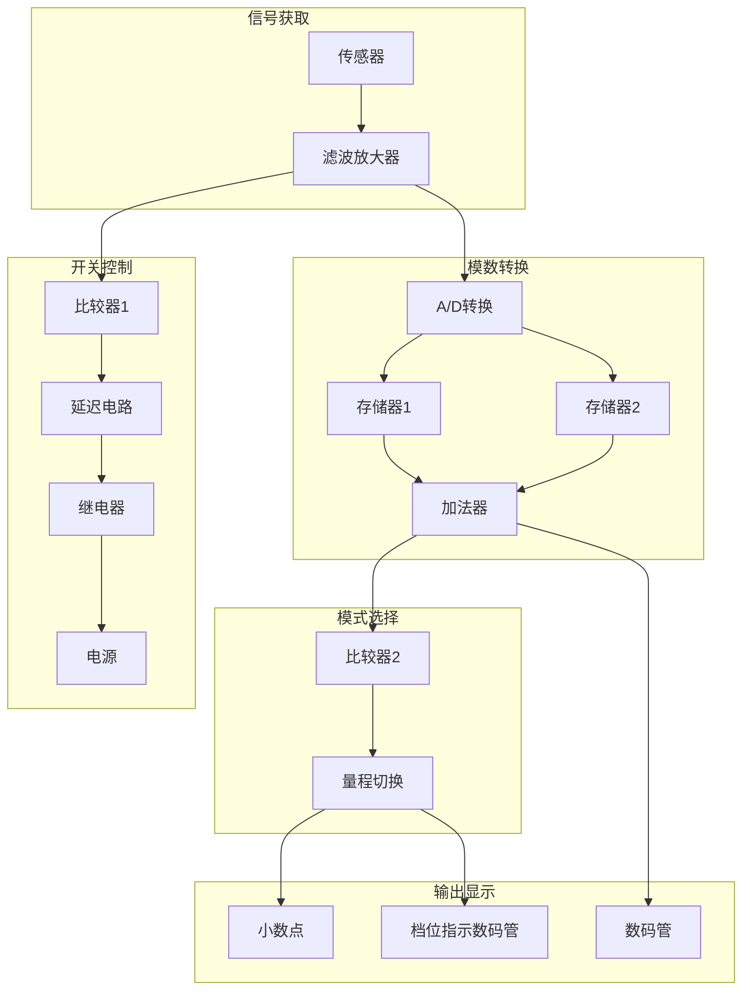

不要像我一样作死用模电去实现。

<!--more-->

# 声明

**本电路由 ZZF（aka：Todd Zhou）设计，作为大二下模电课程设计的作业。未经本人允许，任何人不准使用、转载里面的文字、表格、图片等。你可以参考，但不允许剽窃。**

# 设计题目与要求

设计一个简易电子秤电路，称重范围分为两档：0 ～ 1.999kg，0 ～ 19.99kg。要求：

1. 基本功能
   - [x] （1）当秤盘上有物体时，用数码管显示其重量；（A/D 转换使用 ICL7107 专用集成电路）
         　 （因仿真软件没有 ICL7107，仿真时用电压表替代 A/D 转换与显示电路，即用电压表显示其输出）
   - [x] （2）当物体从秤盘上拿走时，物体重量显示 3 秒后自动切断电源；
   - [x] （3）超称重范围或减称重范围时，两个档位可自动切换量程，（用发光二极管指示量程），且数码管小数点的位置也跟随切换；（仿真时用 2 个发光二极管模拟小数点）
   - [x] （4）设计电路所需的电源。
2. 拓展功能（+1 ～ 10 分）
   - [x] （5）两次秤重有累加功能。
   - [x] （6）称重范围对应的档位编号分别是 1 和 2，用一个数码管显示其档位；
   - [x] （7）去皮功能（设置0参考）
   - [ ] 其他功能的添加。

# 原理方框图

## 方案A

1. 传感器为差动电桥电路，其中一个桥臂为压感电阻，中间两点引出电压差；通过放大器+滤除高频，得到放大的电压：
2. 放大器输出的电压，一个是输出到比较器，如果大于 $\frac{1}{2}V_{cc}$，则触发延迟电路，打开继电器。继电器控制下面的电源
3. 放大器输出的电压，另一个是输出到采样保持器1，再输出到加法器
4. 在一般模式下，另一个采样保持器的信号为0，所以加法器最终输出的信号依然是采样保持器1。若在加法模式下，通过开关，打开保持器2，关闭保持器1，关闭反相放大器，则加法器输出两电压和。若在减法模式，通过开关，打开保持器2，关闭保持器1，打开反相放大器，则加法器输出两电压差。
5. 加法器输出的信号经过比较器，若大于一定值，则切换到大量程，改变ADC的参考电压（或将信号等比例缩小）
6. ADC 转换后点亮数码管

## 方案B

方案B 只是为了凑数的，老师要求至少要有两个方案进行比较。方案B 显然是先进行模数转换，然后再进行运算，而方案A 则是先进行运算，再模数转换。复杂度上其实方案B 会复杂很多（不用单片机），因为模数转换引脚会多很多，而芯片和外部电阻由没比方案A 少，再加之一般数字芯片比模拟芯片会贵一点，所以采用方案A。

# 具体模块分析

## 传感器

我们可以采用市面上常见的桥式称重传感器，其原理即惠斯通电桥：

如图所示，外加直流电压为 $V_s=E_g$，输出电压为 $\Delta U$，则 

$$
\Delta U=\left( \frac{R_2}{R_1+R_2}-\frac{R_3}{R_3+R_4}\right)\cdot V_s
$$

在无称重情况下，$R_1=R_2=$$R_3=R_4=R$，因此 $V_s=0$。在有称重的情况的，形变导致 $R_1=R_3=R-\Delta R$，$R_2=R_4=R+\Delta R$，此时输出电压为：

$$
\Delta U=\left( \frac{R+\Delta R}{2R}-\frac{R-\Delta R}{2R}\right)\cdot V_s=2\Delta R\cdot V_s
$$

但有时候，形变导致的电阻变换为 $R_1=R_3=R$，$R_2=R_4=R+\Delta R$，则输出电压：

$$
\Delta U=\left( \frac{R+\Delta R}{2R+\Delta R}-\frac{R}{2R+\Delta R}\right)\cdot V_s\\
=\frac{\Delta R}{2R+\Delta R}\cdot V_s\approx\frac{\Delta R}{2R}\cdot V_s
$$

假设重量与 $\Delta R$ 成正比，则重量与输出 $\Delta U$ 成正比。由于 Multisim 中并没有称重传感器，所以我们直接构造一个电桥。以下是[611N称重传感器](https://detail.1688.com/offer/575279531289.html)的参数

我们可以计算出：

$$
R=1000Ω, \Delta R_\max=\frac{3\text{mV}}{3\text{V}}\cdot 2R=2 \text{Ω}
$$

考虑到实验室最小的电位器为 100Ω，最终我们取 $R_1=R_2=R_3=R_4=100kΩ$，$\Delta R_1=\Delta R_3=100Ω$。输入电压为 $3V$。在 Multisim 中模拟数据如下：

|$\Delta R$ %|$\Delta U$|$\Delta R$ %|$\Delta U$|
|---:|:---|---:|:---|
|0|14.998nV|30|449.888uV|
|2|29.97uV|40|599.82uV|
|4|59.993uV|50|749.738uV|
|5|74.991uV|60|899.64uV|
|6|89.988uV|70|1.05mV|
|8|119.983|80|1.199mV|
|10|149.978uV|90|1.349mV
|20|299.94uV|100|1.499mV|

<table><tr><td>

</td><td>

</td></tr></table>

可以看出，增长率大约为 15uV/1%，可看作线性增长。考虑到实际中，第二档最大重量19.99kg 对应 3mV；则第一档最大重量1.999kg 对应300uV，分界线为 $\Delta R=20Ω$

## 电源

实际生活中的称大部分用的是干电池（高端一点的用锂电池），当然不排除地秤可能用交流电，但我认为这种小秤，用直流就好了。所以采用4节干电池，得到 6V 的单电源，为了方便后面的接线，将其转化为 ±3V 的双电源。我们选择 $V_\text{in}$ 在 4~15V 的LM386。参考的电路图如下（图中少连了负反馈）：

模拟结果如下：

（18脚悬空，减小噪音）

## 滤波放大器

输入 0~3mV，至少放大 100倍到 0~0.3V，至多放大 1000 倍到 0~3V。这个不是事儿，调一下参数即可。考虑到只能提供 ±3V 的电源，我们采用工作范围在 （±1.5V\~±15V）的 LM324，采用仪表放大器的形式：

通过计算可知：

$$
V_\text{out}=(V_\text{in1}-V_\text{in2})\cdot\frac{R_5+R_G+R_6}{R_G}\cdot \frac{R_2}{R_1}\\
其中,R_5=R_6,R_2=R_4,R_1=R_3
$$

选取电路参数如下：

经过测试，$A_{uc}=\frac{-15.487\text{mV}}{10\text{mV}}=-1.5487$，$A_{ud}=\frac{-1014\text{mV}}{2\text{mV}}=-507$，共模抑制比 $K_\text{CMR}=\vert\frac{A_{ud}}{A_{uc}}\vert=327.4$。但经过后面一系列测试，无论共模信号是什么，输出始终为 -15.487mV，所以我认为这是零漂，并增加了调零部分：

再次测试后，$A_{uc}=\frac{-602.087\text{uV}}{10\text{mV}}=-6\times10^{-2}$，$A_{ud}=\frac{-998.722\text{mV}}{2\text{mV}}=-507$，共模抑制比 $K_\text{CMR}=\vert\frac{A_{ud}}{A_{uc}}\vert=8450$。显然性能得到很大改善。

我们的输入是单端输入，测试得到的电压点如下表，可以看出，输出与输入近似正比例关系。

|$\Delta U$|$V_\text{out}$|$\Delta U$|$V_\text{out}$|$\Delta U$|$V_\text{out}$|
|---|---|---|---|---|---|
|50u|25.248m|0.4m|199.98m|1m|499.52m|
|100u|50.21m|0.5m|249.903m|1.5m|749.137m|
|150u|75.172m|0.6m|299.827m|2m|998.754m|
|200u|100.133m|0.7m|349.75m|2.5m|1.248|
|250u|125.095m|0.8m|399.673m|3m|1.498|
|300u|150.057m|0.9m|499.597m|

## 开关控制模块

20kg时得到的 $V_\text{out}=1.498V$，我们假设大于 20g 时开关自动打开（实在不想弄得太复杂），则对应 $V_\text{out}=1.498mV$。根据相关资料，继电器的吸合电压至少为 3/4*额定电压，按照 5V 的额定电压，则至少输出 3.75V。所以我们采用一个开路运放和一个RC延时电路，电路形式如下：

图中 R3 表示不同值的 $V_\text{out}$，当其稍微偏离 0 时，会被运放无限放大，但不会超过电源，所以 U1A 只会输出约 $\pm 2.8V$。当输出正电压时，U1B会同步输出正电压，同时 C1 充电；当输出负电压时，C1 缓慢放电（3s），直到电压小于 30mV，U1B 输出负电压。

根据零输入响应：$u_c = u_c(0_+)e^{-t/RC}$，计算出 $t=RC\ln{933}=3$，从而 $RC=0.44$，取$R=1kΩ$，$C=47\mu F$

U1B 后面接继电器，为了获取 3.75V 以上的压差，继电器另一脚要接 -3V（为了避免电流过大还需要接一个电阻）

## 采样保持器

最基本的采样保持器如下图：

主要的问题在于开关。考虑到需要在两个采样保持器之间进行切换，以及无物体时也要保持3s，所以总共会有两个开关：一个是三脚的拨动开关，用于切换保持器；另一个是由开关控制模块引出的一个控制模块（为了省事直接用继电器，当然也有考虑用三极管）

仿真时发现电压有漂移……还好这个漂移好像是恒定的，直接调整前面的零漂即可。

## 加法器

这个就是最简单的加法器，不过很遗憾，依然是有一定的漂移……总之调前面的零漂。加法器与实际电路连在一起时，V5 始终是采样保持器1的值；而 V4 和 V3 则通过一个自锁的按键开关来控制，一个连接采样保持器，另一个接地，按下开关后反转。

## 模式选择模块

和电源控制模块的比较器差不多，不过范围需要更加精确，所以我们使用电位器来确定反相输入端电压。同时后面通过电压控制开关（也就是继电器）来选择输入到 ADC 的参考电压。

我也考虑过改变前面的放大倍数，但是这要求模式选择模块的输入必须是放大前的信号，

## 输出显示模块

由于 Multisim 中并无该芯片，所以暂时不讨论。不过总的来说，我们只需要输入参考电压与测量电压。

# 问题与改进

问题一：当拿开物体时，放大电压会瞬间小于1mV，会**很快**导致后续的电压也降为0。如果要实现保持3s依然有输出，则必须有一个更快的信号将后续的保持电路与前面断开。但在 multisim 中，继电器闭合得不够快，而实际中也难以保证成功。

问题二：模拟过程中发现每个运放都会有 1~2mV 左右的偏差，我不能完全确定这是否与输入有关。目前看来这是恒定的，这样的话直接调整放大模块的调零电阻即可。但如果不是恒定的，那么会造成测量非线性，难以消除偏差。

问题三：模拟时发现保持器会有 RLC 振荡，并且 C 越大，越久稳定。目前 10uF 大概需要 0.3ms。考虑到问题一，则显然 C 越大越好，这就是问题。

问题四：

# 成品与总结

点击链接查看：
* <a href="https://i.loli.net/2020/03/19/yU2OoTdZDP1g3bw.jpg" data-lightbox="image-2" data-title="电子秤1.0">电子秤1.0</a>
   
   纯粹是上面各个模块的组合，修改了部分参数，电路形式无变化。

* <a href="https://i.loli.net/2020/03/20/X2PEuW98ReAQYZw.jpg" data-lightbox="image-2" data-title="电子秤1.1">电子秤1.1</a>
   
   在加法器后面增加了采样保持器3，以完成拿起物体保持显示的功能（但效果不是很好）

* <a href="https://i.loli.net/2020/09/18/7phnH1WJCmxXMUa.jpg" data-lightbox="image-2" data-title="电子秤1.2">电子秤1.2（最后上交的图）</a><!---->

   老师要求用交流电，于是增加了交流转直流

总的来说，感觉电路应该是可以工作的，但准不准就是另一回事了。然后那个ICL7107显示模块我懒得弄了，反正仿真又没有，实物又没有，就留个遗憾吧。最后不得不吐槽自己的垃圾画图，还是得找些培训机构的视频看。

# 附录

## 实验室提供的元器件

常见的电阻、瓷片电容、电解电容，以及部分模拟IC、数字IC、二三极管等。

模拟IC：

|芯片|功能|芯片|功能|芯片|功能|
|---|---|---|---|---|---|
|UA741|单运放|LM385|2.5V基准电压源|TIP41C|NPN型功放管|
|LM358|双运放|7805|5V稳压器|TIP42C|PNP型功放管|
|LM324|四运放|7809/7909|±9V稳压器|TIP122|达林顿调整管|
|LM311|比较器|7815/7915|±15V稳压器|LM386|功率放大器|
|LM339|四合一比较器|LM317|正压调压器|TDA2030|功率放大器|
|||LM337|负压调压器|KA331|V-F/F-V转换器|

数字IC：

|芯片|功能|芯片|功能|芯片|功能|
|---|---|---|---|---|---|
|74HC32|四组2输入端或门|74LS74|双D边沿触发器|CD4511|BCD-锁存/7 段译码器/驱动器|
|74LS08|四组2输入端与门|CD4013|双D触发器|ICL7107|$3\frac{1}{2}$位双积分型A/D转换器|
|CD4081|四组2输入端与门|CD4052|双四选一模拟开关|CD4026|十进制计数器/译码器|
|CD4001|四组2输入端或非门|CD4066|四双向模拟开关|CD40110|十进制可逆计数器/锁存器/译码器/驱动器|
|74LS00|四组2输入端与非门|CD4532|8线-3线优先编码器|CD4518|二/十进制同步加法计数器 |
|74LS14|六反相施密特触发器|74LS138|3线-8线译码器|74LS90|异步二-五-十进制加法计数器|
|CD40106|六反相施密特触发器|74LS47|BCD-7段译码器/驱动器|74LS161|同步二进制计数器|

二极管：
* 普通二极管：1N4148
* 整流管：1N4001
* 稳压管：3V/5.1V/6.2/V8.2V/9.1V/10V12V
* 发光二极管

三极管：
* PNP型三极管：S9012
* NPN型三极管：S9013、C1815、2N3904、9014、9018

以及一些奇奇怪怪的东西：红外发射管/红外接收管，单向可控硅，报警声音乐片等

## 参考资料

以下是我在设计前参考的一些资料。

电子秤总体参考方案：
* [《电子秤模拟部分电路设计》——模电大作业](https://experiments.fabre-li.com/《电子秤模拟部分电路设计》——模电大作业/)
* [电子秤设计电路图汇总（六款模拟电路设计原理图详解）](http://www.elecfans.com/dianlutu/187/20180130626160_a.html)
* [简易电子秤的系统设计](http://www.shslcz.com/m/view.php?aid=397)
* [PIC 低價高性能電子秤的設計](https://blog.xuite.net/wensanko/twblog/139306647-PIC+低價高性能電子秤的設計)

直流稳压电源：
* [7805 datasheet](https://wenku.baidu.com/view/1b90f8cfda38376baf1faef6.html)
* [在7805稳压电路中电容该如何选择？](http://www.elecfans.com/article/83/144/2018/20180106611525.html)
* [稳压电路的滤波电容值具体怎么计算？](https://www.zhihu.com/question/33572118)
* [正负5V直流稳压电源设计](https://wenku.baidu.com/view/d5a0f2f70975f46527d3e154.html)

差动电桥放大器：
* [电桥放大器的原理及应用](https://wenku.baidu.com/view/2367c4ac65ce05087632133f.html)
* [差动电桥电路在传感器测量中的应用](http://www.wanfangdata.com.cn/details/detail.do?_type=perio&id=dzzz201207108)
* [惠斯登电桥在称重传感器中的应用](https://wenku.baidu.com/view/c79edf7831b765ce05081495.html)

仪表运算放大器
* [仪表放大器和运算放大器优缺点对比](https://blog.csdn.net/xiahailong90/article/details/94388337)
* [仪表放大器的正确使用方法](https://www.21ic.com/jichuzhishi/analog/questions/2017-01-17/700055.html)

采样保持电路：
* [采样保持电路图](http://www.elecfans.com/dianlutu/dianyuandianlu/20101008224239.html)
* [采样保持电路](https://blog.csdn.net/lanzix/article/details/1828052)
* [可控硅延时控制电路图解](https://www.dianyuan.com/article/43764.html)

延时电路：
* [ne555延时电路](http://www.elecfans.com/article/88/131/555/2018/20180328653812.html)
* [555定时器及50个经典设计电路](https://zhuanlan.zhihu.com/p/67923210)
* [单运放构成的单稳态电路](http://www.elecfans.com/analog/20120107257360.html)
* [358延时电路](https://wenku.baidu.com/view/3c3625d328ea81c758f578bc.html)

单电源供电：
* [使用单电源的运放交流放大电路(含同相和反相输入式)](https://wenku.baidu.com/view/ffbdbe77680203d8cf2f245d.html)
* [单电源运放和双电源运放有啥区别？这篇文章讲透了](https://www.sohu.com/a/321387578_100281310)
* [单电源供电回路中如何获得正负电源](http://www.elecfans.com/dianyuan/399089.html)

减法器：
* [减法器电路设计方案汇总](http://m.elecfans.com/article/617311.html)

开关控制电路：
* [开关控制电路整理](https://wenku.baidu.com/view/2e86b91152d380eb62946df5.html)

LM324 集成运放：
* [LM324 - Single Supply Quad Operational Amplifiers](https://www.onsemi.cn/PowerSolutions/document/LM324-D.PDF)
* [LM324关于单电源供电与双电源供电](http://www.elecfans.com/dianzichangshi/20171109576960.html)

LM386 集成运放：
* [LM386 低损耗电源功率放大器](https://wenku.baidu.com/view/f002767f27284b73f2425028.html)
* [LM 386 电子发烧友](https://wenku.baidu.com/view/7826ec09581b6bd97f19eac9.html)

ICL7107 双积分型A/D转换器：
* [datasheet/icl7106-07-07s.pdf](https://www2.renesas.cn/cn/zh/www/doc/datasheet/icl7106-07-07s.pdf)
* [datasheet/icl7107.pdf](http://pdf.datasheetcatalog.com/datasheet/maxim/ICL7106-ICL7107.pdf)
* [icl7107中文资料详细](http://www.elecfans.com/yuanqijian/yinjiaotu/20180208632667_a.html)
* [基于ICL7107器件的量程自切换数字电压表的设计与实现](https://wenku.baidu.com/view/7e1a45136c175f0e7cd1379f.html)
* [Digital voltmeter using ICL7107](https://www.circuitstoday.com/digital-voltmeter-using-icl7107)
* [Digital voltmeter circuit diagram using ICL7107 / 7106 with PCB](https://www.eleccircuit.com/digital-voltmeter-using-icl7107/)