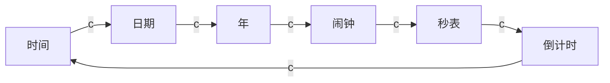
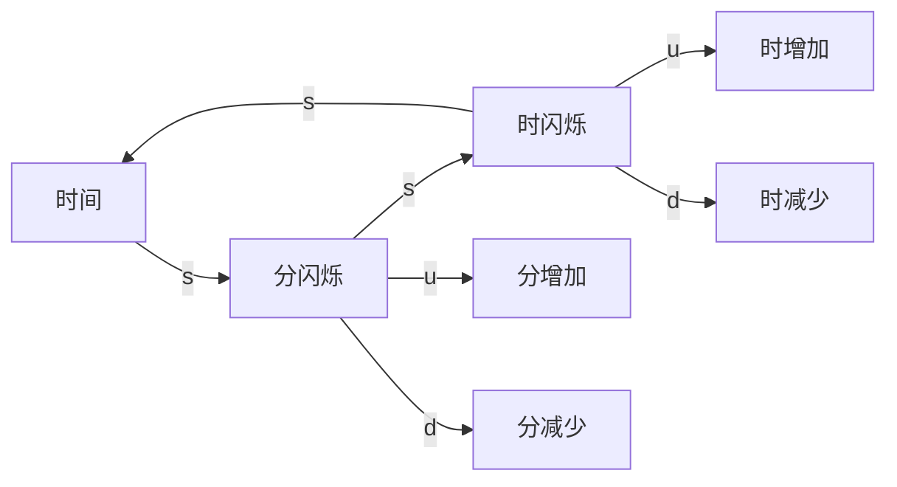
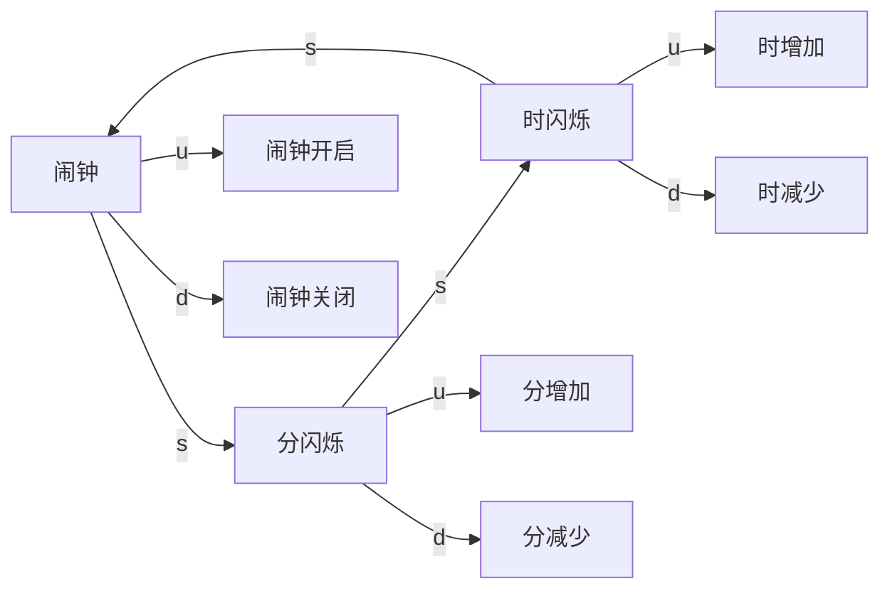
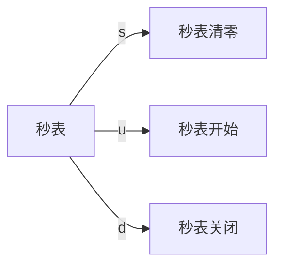
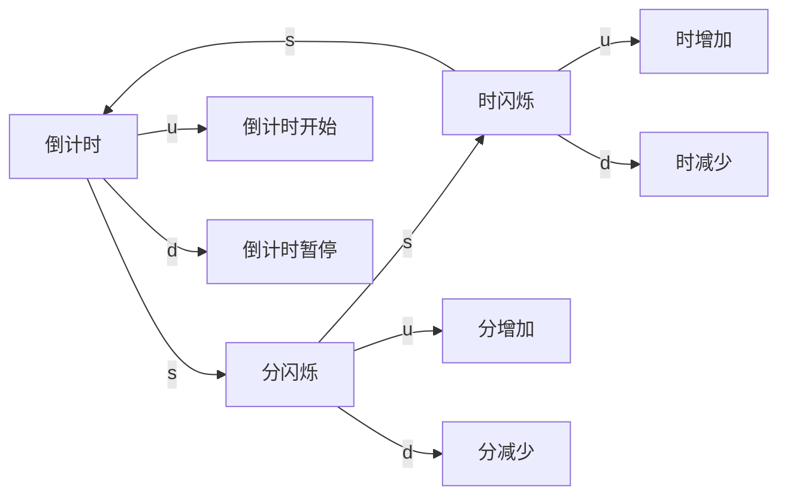

享受操纵所有寄存器的快感~

<!--more-->
<!-- more -->

# 声明

**本项目由 ZZF（aka：Todd Zhou）设计，由ZZF、LDF、ZJC编程实现，作为大二下微机课程设计的作业。未经本人允许，任何人不准使用、转载里面的文字、表格、图片等。你可以参考，但不允许剽窃。**

**另外，这里所有的汇编代码均由我们（ZZF、LDF、ZJC）手动输入，仅参考了开发板附带的C语言范例（用于确定硬件连线及时序），未参考互联网、往届同学的设计。因此我可以保证本项目的原创性。**

# 题目

通过按键切换完成以下功能：

- [x] 基本要求
	- [x] 显示北京时间；
	- [x] 能够校准时间；
	- [x] 使用汇编语言；
	- [x] 时、分、秒之间或年、月、日间以小数点分隔；
- [x] 发挥性要求
	- [x] 显示公历日期
	- [x] 能够校准日期
	- [x] 运动秒表
	- [x] 闹钟功能
	- [x] 倒计时
	- [x] 亮度调节
	- [ ] ~~PC联机校准时间等~~

完成时间：

* 2020/08/25：计时
* 2020/08/26：显示
* 2020/08/27：按键
* 2020/08/28：验收
* 2020/08/30：成绩94分(ﾉ´▽｀)ﾉ♪

# 分析

## 程序

&emsp;&emsp;从题目中可以看出，主要有三个部分：

1. 显示
2. 计时
3. 按键

&emsp;&emsp;这三个部分需要并行运行，其中，显示和计时都是间隔一段时间再运行，只有按键需要一直扫描，所以显示和计时分别用定时器0和定时器1来定期运行，按键则在主程序中循环扫描。

&emsp;&emsp;那么可不可以都用中断来响应按键呢？很遗憾，受硬件限制，不能。开发板上的中断0和1分别连接了一个按键，但是要实现所有功能，至少需要 4 个按键，显然中断上连接的按键是不够用的。当然，也可以两个按键用中断，两个按键用扫描，但这样的话太麻烦了，代码写起来不够美观，不过出于炫技可以试一下(￣▽￣)~*。

## 数据

&emsp;&emsp;那么如何存储数据呢？综合来看，我们主要需要存储以下数据：

* 时间
	* 当前时间：毫秒、秒、分、时、日、月、年
	* 闹钟：分、时
	* 秒表：毫秒、秒、分
	* 倒计时：毫秒、秒、分
* 状态
	* 当前模式：时间、日期、年份、闹钟、秒表、倒计时
	* 开关：闹钟、秒表、倒计时
	* 选中LED闪烁：前两位、后两位
	* LED闪烁计时

三个程序部分通过数据连接起来，即：计时改变时间数据，按键改变时间和状态数据，显示则读取时间和状态数据。

除此之外，还有一些数据要存放在 ROM 中，比如每个月的天数、LED显示编码等

# 设计

## 数据格式

&emsp;&emsp;总的来说，时间存放字节寻址区（30H\~7FH），状态存放在位寻址区（20H\~2FH）。

> 程序中的变量名应该与括号中的英文一致。

### 字节寻址区

当前时间（*Time*）存放在 50H~56H，具体来说：

* 56H：年（只保存后两位，即 20XX 的 XX）（*Time_year*）
* 55H：月（*Time_month*）
* 54H：日（*Time_day*）
* 53H：时（*Time_hour*）
* 52H：分（*Time_minute*）
* 51H：秒（*Time_second*）
* 50H：毫秒×10（*Time_ms*）

闹钟（*Alarm*）存放在 57H~58H，具体来说：

* 57H：分（*Alarm_minute*）
* 58H：时（*Alarm_hour*）

秒表（*Stopwatch*）存放在 59H~5BH，具体来说：

* 59H：毫秒×10（*Stopwatch_ms*）
* 5AH：秒（*Stopwatch_second*）
* 5BH：分（*Stopwatch_minute*）

倒计时（*Countdown*）存放在 5CH~5EH，具体来说：

* 5CH：毫秒×10（*Countdown_ms*）
* 5DH：秒（*Countdown_second*）
* 5EH：分（*Countdown_minute*）

待显示（*Show*）的二进制数

* 5FH：低两位，即右边两位（*Show_low*）
* 60H 高两位，即左边两位（*Show_high*）

数码管亮度（*Brightness*）：

* 65H：亮度（*Brightness*）

### 位寻址区

当前模式（*Mode*）存放在 20H，具体来说：（从低位到高位）

0. 时间（*Mode_time_bit*）
1. 日期（*Mode_date_bit*）
2. 年份（*Mode_year_bit*）
3. 闹钟（*Mode_alarm_bit*）
4. 秒表（*Mode_stopwatch_bit*）
5. 倒计时（*Mode_countdown_bit*）

开关（*Flag*）存放在 21H，具体来说：（从低位到高位）

0. 闹钟开关（*Flag_alarm_bit*）
1. 秒表开关（*Flag_stopwatch_bit*）
2. 倒计时开关（*Flag_countdown_bit*）
3. 静音开关（*Flag_mute_bit*）（判断蜂鸣器响后是否有按下按钮）

LED闪烁（*Blink*）存放在 22H，具体来说：（从低位到高位）

0. 低两位LED（*Blink_low_bit*）
1. 高两位LED（*Blink_high_bit*）

闪烁计数0、1、2（*Blink_count*）存放在 23H~25H，具体来说：

* 23H：闪烁计数0（*Blink_count0*）
	* 闪烁计数0最高位（*Blink_count0_bit*）
* 24H：闪烁计数1（*Blink_count1*）
	* 闪烁计数1最高位（*Blink_count1_bit*）
* 25H：闪烁计数2（*Blink_count2*）
	* 闪烁计数2最高位（*Blink_count2_bit*）

另外规定一下，R0~R1 是按键循环用，R2~R3 是计时用，R4~7 是LED用

### 引脚

数码管（*LED*）选中端：

* P0.3：右起第一个LED（*LED1*）
* P0.2：第二个LED（*LED2*）
* P0.1：第三个LED（*LED3*）
* P0.0：第四个LED（*LED4*）

HC595 串行转并行芯片相关引脚：

* P0.4：HC595_SCK
* P0.5：HC595_RCK
* P0.6：HC595_RST
* P0.7：HC595_DAT

蜂鸣器引脚：

* P1.3：BEEP（置零时响）

键盘扫描引脚：

* P2.4：改变模式键（*Change_mode*）
* P2.5：设置键（*Setting*）
* P2.6：上键（*Up*）
* P2.7：下贱~（*Down*）


## 按键逻辑

一共有四个按键，分别为：

* c：change mode 功能切换
* s：setting 设置
* u：up 上
* d：down 下


1. 在任何情况下按 c：切换模式并停止闪烁；
2. 在时间、日期、倒计时下按 s：前两位LED闪烁；再按 s：后两位LED闪烁；再按 s：不闪烁；

	在年下按 s：四位一起闪烁；再按 s：不闪烁；

	在秒表下按 s：停止计时并清零；
3. 在闪烁时按下 u/d：对应数据增/减；

	在闹钟下按 u：开启闹钟；

	在闹钟下按 d：关闭闹钟；

	在秒表下按 u：开始计时；

	在秒表下按 d：暂停计时；

	在倒计时下按 u：开始计时

	在倒计时下按 d：暂停计时


为了方便理解，可以参考下面的状态转换图：











当然里面还有很多细节（比如蜂鸣器等）并没有展示出来。

# 编程

```
;程序结构一览：
; 51Watch/
;├─ 定义RAM区变量/
;├─ 程序跳转/
;├─ 定义ROM区数据/
;├─ MAIN主程序/
;│  ├─ 设置寄存器初值
;│  ├─ 键盘扫描/
;│  │  ├─ 读取按键
;│  │  ├─ 消抖
;│  │  ├─ 响应按键/
;│  │  │  ├─ 响应change mode键
;│  │  │  ├─ 响应setting键
;│  │  │  ├─ 响应up键
;│  │  │  ├─ 响应down键
;├─ 定时器0（计时）/
;│  ├─ 增加毫秒、秒、分、时、日、月、年
;│  ├─ 检查闹钟
;│  ├─ 增加秒表
;│  ├─ 减少倒计时
;├─ 定时器1（显示）/
;│  ├─ 读取当前模式&闪烁模式
;│  ├─ 读取待显示数据
;│  ├─ 数据转换
;│  ├─ 输出到HC595
;│  ├─ 显示
;├─ 中断0（增加亮度）/
;├─ 中断1（减少亮度）/
```

## 定义RAM区变量

&emsp;&emsp;这一部分和前面“设计”的类似，但为了实现额外的功能，可能会增加几个变量。

<details>

;;;;;;;; 定义RAM区变量 开始  ;;;;;;;;;;;

;命名规则：
;	首字母大写，后面字母小写的都是RAM变量；
;	后面带bit的都是位变量

;Time 当前时间;
Time_ms            EQU 50H ;实际为 msx10，后面的ms都一样
Time_second        EQU 51H
Time_minute        EQU 52H
Time_hour          EQU 53H
Time_day           EQU 54H
Time_month         EQU 55H
Time_year          EQU 56H

;Alarm 闹钟;
Alarm_minute       EQU 57H
Alarm_hour         EQU 58H

;Stopwatch 秒表;
Stopwatch_ms       EQU 59H
Stopwatch_second   EQU 5AH
Stopwatch_minute   EQU 5BH

;Countdown 倒计时;
Countdown_ms       EQU 5CH
Countdown_second   EQU 5DH
Countdown_minute   EQU 5EH
	
;Show 待显示的二进制数;
Show_low           EQU 5FH
Show_high          EQU 60H

;BCD 待显示的BCD字符
BCD1               EQU 61H
BCD2               EQU 62H
BCD3               EQU 63H
BCD4               EQU 64H
	
;Brightness 亮度;
Brightness         EQU 65H

;Last_button 上一个按键;（用于防止按键过快响应）
Last_button        EQU 66H

;Mode 当前模式;
Mode               EQU 20H
Mode_time_bit      EQU 00H
Mode_date_bit      EQU 01H
Mode_year_bit      EQU 02H
Mode_alarm_bit     EQU 03H
Mode_stopwatch_bit EQU 04H
Mode_countdown_bit EQU 05H

;Flag 开关标志;
Flag               EQU 21H
Flag_alarm_bit     EQU 08H
Flag_stopwatch_bit EQU 09H
Flag_countdown_bit EQU 0AH
Flag_mute_bit      EQU 0BH ;判断蜂鸣器响后是否有按下按钮
Flag_show_stopwatch_ms EQU 0CH


;Blink LED闪烁;
Blink              EQU 22H
Blink_low_bit      EQU 10H
Blink_high_bit     EQU 11H

;Blink_count0 闪烁计数0; 一个不够用，所以要三个（其实我甚至想要四个）
Blink_count0       EQU 23H
Blink_count0_bit   EQU 1FH

;Blink_count1 闪烁计数1;
Blink_count1       EQU 24H
Blink_count1_bit   EQU 27H

;Blink_count2 闪烁计数2;
Blink_count2       EQU 25H
Blink_count2_bit   EQU 2FH


;数码管选中端;
LED1        BIT P0.3 ;最右边
LED2        BIT P0.2
LED3        BIT P0.1
LED4        BIT P0.0 ;最左边

;HC595 芯片相关引脚;
HC595_SCK   BIT P0.4
HC595_RCK   BIT P0.5
HC595_RST   BIT P0.6
HC595_DAT   BIT P0.7

;蜂鸣器引脚;
BEEP        BIT P1.3

;键盘扫描引脚;
Change_mode BIT P2.4
Setting     BIT P2.5
Up          BIT P2.6
Down        BIT P2.7

;;;;;;;;; 定义RAM变量 结束 ;;;;;;;;;;;;

</details>

## 初始化程序跳转

&emsp;&emsp;这个地址是固定的，也就没啥好说的。反正为了炫技，两个中断，两个定时器都用上了。

<details>

;;;;;;;;; 程序跳转 开始 ;;;;;;;;;;;

ORG 0000H
	LJMP MAIN ;主程序（键盘扫描）
ORG 0003H
	LJMP BRIGHTER ;外部中断0（亮度增加）
ORG 000BH
	LJMP INT_T0 ;定时器0（计时）
ORG 0013H
	LJMP DARKER ;外部中断1（显示）
ORG 001BH
	LJMP INT_T1 ;定时器1（亮度减少）
	
;;;;;;;; 程序跳转 结束 ;;;;;;;;;;;

</details>


## 定义ROM区

&emsp;&emsp;这里存储的是固定的数据。

* *DAYS_OF_MONTH*：每个月的日数。由于这个是用于比较日期有无超过当月日数，所以实际是当月日数再+1。
* *LED_SEGMENT_CODE* 与 *LED_SEGMENT_CODE_DOT*：LED显示编码，即相应数字需要点亮的LED。带 *_DOT* 表示会点亮数码管右下角的小数点。

<details>

;;;;;;;; ROM区数据 开始 ;;;;;;;;;;

ORG 0030H

DAYS_OF_MONTH:
	DB 0 ;0月（不存在）
	DB 32,29,32,31 ;一、二、三、四
	DB 32,31,32,32 ;五、六、七、八
	DB 31,32,31,32 ;九、十、十一、十二

;学校的开发板
LED_SEGMENT_CODE:
	DB 0FCH,60H,0DAH,0F2H,66H,0B6H,0BEH,0E0H,0FEH,0F6H,00H ;0~9 不带点
CHECK_COUNTDOWN_BUG:
	DB 0FCH,60H,0DAH,0F2H,66H,0B6H,0BEH,0E0H,0FEH,0F6H,00H ;0~9 不带点
LED_SEGMENT_CODE_DOT:
	DB 0FDH,61H,0DBH,0F3H,67H,0B7H,0BFH,0E1H,0FFH,0F7H ;0.~9. 带点
		
;;;;;;;; ROM区数据 结束 ;;;;;;;;;

</details>

## 设置变量初值&按键

&emsp;&emsp;预设好开机时显示的时间、中断开关（IE）、中断优先级（IP）、计时器模式（TMOD）等。然后就开始主程序——按键扫描。

&emsp;&emsp;按键扫描的过程很简单。我们对行引脚赋0，列引脚赋1，按下按键时，对应的列引脚与行引脚导通，使得列引脚的输入为0，读出当前引脚状态，就知道哪个键被按下。

&emsp;&emsp;知道后就根据当前模式和闪烁状态来作出相应的响应（这句话有点绕）。我们一个一个讲：

1. 按下了 `C` 键：
    * *Mode* 左移一位，如果到了最高位，则赋值 01H
	* *Blink* 清零
2. 按下了 `S` 键：
    1. 如果是在时间、日期、闹钟、倒计时模式：
	    * *Blink* 左移一位，如果到了最高位，则幅值 00H
	2. 如果是在年模式：
	    * *Blink* 在 11H 和 00H 之间相互转换
	3. 如果是在秒表模式：
	    * *Flag_stopwatch_bit* 清零，停止计时
		* *Stopwatch_ms*，*Stopwatch_second*，*Stopwatch_minute* 全部清零，计时清零
3. 按下了 `U` 键
    1. 如果是在时间、日期、年、闹钟、倒计时模式且 *Blink* 不等于0：
	    * 对应数据（分/时/日/月/年）加 1
	2. 如果是在倒计时且 *Blink* 等于 0：
	    * 开始倒计时，*Flag_countdown_bit* 置 1
	3. 如果是在闹钟且 Blink 等于 0：
	    * 打开闹钟，*Flag_alarm_bit* 置 1
	4. 如果是在秒表：
	    * 开始计时，*Flag_stopwatch_bit* 置 1
4. 按下了 `D` 键
    1. 如果是在时间、日期、年、闹钟、倒计时模式且 *Blink* 不等于0：
	    * 对应数据（分/时/日/月/年）减 1
	2. 如果是在倒计时且  *Blink* 等于 0：
	    * 暂停倒计时，*Flag_countdown_bit* 置 0
	3. 如果是在闹钟且 *Blink* 等于 0：
	    * 关闭闹钟，*Flag_alarm_bit* 置 0
	4. 如果是在秒表：
	    * 暂停计时，*Flag_stopwatch_bit* 置 0

&emsp;&emsp;还有一些小细节，比如：如果现在是 2020年2月29日，现在我们增加年份，变成 2021年2月，此时日要改为 28.

<details>

;;;;;;;; MAIN主程序 开始 ;;;;;;;;;;

ORG 100H

MAIN:
	;设置年月日时分秒初值
	MOV Time_year,   #20 ;2020 ;年只存储个位和十位
	MOV Time_month,  #08 ;8月29日晚20点10分在科学馆406会议室验收
	MOV Time_day,    #29
	MOV Time_hour,   #20
	MOV Time_minute, #10
	MOV Time_second, #50
	MOV Time_ms,     #0
	
	;设置闹钟初值
	MOV Alarm_hour,   #20
	MOV Alarm_minute, #11
	
	;设置秒表初值
	MOV Stopwatch_minute, #0
	MOV Stopwatch_second, #0
	MOV Stopwatch_ms,     #0
	
	;设置倒计时初值
	MOV Countdown_minute, #0
	MOV Countdown_second, #10
	MOV Countdown_ms,     #0
	
	;设置亮度初值
	MOV Brightness, #1000B
	
	;设置模式Mode初值
	MOV Mode, #01H
	
	;设置开关Flag初值
	MOV Flag, #00H
	SETB Flag_alarm_bit ;打开闹钟
	
	;设置LED闪烁Blink初值
	MOV Blink, #00B
	
	;设置闪烁计数Blink_count初值
	MOV Blink_count0, #00H
	MOV Blink_count1, #00H
	
	;设置HC595
	SETB HC595_RST
	MOV P0, #00H
	
	;MOV IE, #10001010B ;不开启亮度调节
	MOV IE, #10001111B ;开启亮度调节
	
	;计时（定时器0）的优先级高于其他
	MOV IP, #00000010B
	
	;定时器0定时时间较长，故为模式1
	;定时器1用于显示，需要定时刷新，为模式2
	MOV TMOD, #00100001B
	
	;定时器0的计算过程在定时器0中断子程序处
	;定时器1就是取最大时间
	MOV TL0, #006H
	MOV TH0, #0D9H
	MOV TL1, #00H
	MOV TH1, #00H
	
	;开启定时器0、定时器1
	SETB TR1
	SETB TR0
	
	;;;;;;;;;;;;;;;; 键盘 开始 ;;;;;;;;;;;;;;;;;
	
	LOOP:
		MOV P2, #0FH ;矩阵键盘行赋1，列赋0
		MOV R0, P2 ;获取矩阵键盘输入
		;本来想着“没有按下按键”就不用消抖了，直接重新扫描就行
		;但学校的开发板的按键抖动得太厉害
		;不得已连“没有按下按键”也要先消抖再判断
		;如果开发板比较新，可以去掉下面三行的注释
		;CJNE R0, #0FH, DOUBLE_CHECK ;如果按下按键则二次检查
		;MOV Last_button, #0 ;清除上一个按键
		;SJMP LOOP
		
		DOUBLE_CHECK: ;二次检查，消抖
			MOV A, #10 ;两次检查的间隔时长 ;可根据抖动情况适当修改为1~99，建议不要超过10
			ADD A, Time_ms
			MOV B, 100
			DIV AB
			DELAY_MS: ;延时
				MOV A, #50
				CLR C
				SUBB A,Time_ms
				JZ DELAY_MS
			MOV A, P2
			XRL A, R0 ;第一次和第二次检查的值是否相同
			;JZ  CHECK_NO_BUTTON ;如果抖动得比较厉害需要增加三次检查
			JZ  TRIPLE_CHECK ;三次检查
			;MOV Last_button, #0 ;这行可以有，但没必要
			SJMP LOOP ;两次检查的值不同，重新扫描
			
		TRIPLE_CHECK: ;三次检查，还是消抖 ;只针对抖动比较厉害的开发板
			MOV A, #10 ;两次检查的间隔时长 ;可根据抖动情况适当修改为1~99，建议不要超过10
			ADD A, Time_ms
			MOV B, 100
			DIV AB
			DELAY_MS1: ;延时
				MOV A, #50
				CLR C
				SUBB A,Time_ms
				JZ DELAY_MS1
			MOV A, P2
			XRL A, R0 ;第一次和第三次检查的值是否相同
			JZ  CHECK_NO_BUTTON
			;MOV Last_button, #0 ;这行可以有，但没必要
			SJMP LOOP ;两次检查的值不同，重新扫描
			
		CHECK_NO_BUTTON:
			MOV A, R0
			CJNE A, #0FH, CHECK_LAST_BUTTON
			MOV Last_button, #0 ;清除上一个按键
			SJMP LOOP
		

		CHECK_LAST_BUTTON: ;检查上次按键与这次按键是否相同，用于解决按键响应过快的问题
			MOV A, R0
			CJNE A, Last_button, CHECK_CHANGE_MODE ;不相同，处理按键
			MOV Last_button, R0 ;保存该次的按键
			SJMP LOOP ;相同，等到松手再按才处理
			
		
		CHECK_CHANGE_MODE:
			SETB Flag_mute_bit ;打开静音开关（用于关闭闹钟）
			SETB BEEP ;关闭蜂鸣器
			MOV Last_button, R0
			CJNE R0,#07H,CHECK_SETTING ;不是 Change Mode 键就检查下一个键
			SJMP CHANGE_MODE_DOWN ;是就执行相应的程序
		CHECK_SETTING:
			CJNE R0,#0BH,CHECK_UP ;不是 Setting 键就检查下一个键
			SJMP SETTING_DOWN ;是就执行相应的程序
		CHECK_UP:
			CJNE R0,#0DH,CHECK_DOWN ;不是 Up 键就检查下一个键
			SJMP UP_DOWN ;是就执行相应的程序
		CHECK_DOWN:
			CJNE R0,#0EH,LOOP ;不是 Down 键就重新扫描
			LJMP DOWN_DOWN ;是就执行相应的程序
			
		CHANGE_MODE_DOWN: ;按下 Change Mode 键
			MOV Blink,#0H ;取消闪烁
			JB Mode_countdown_bit,MODE_HIGH ;已经到了最后一个模式，回到第一个模式
			MOV A, Mode
			RL A
			MOV Mode, A ;切换下一个模式
			SJMP LOOP
			MODE_HIGH:
				MOV Mode,#1
				SJMP LOOP
				
		SETTING_DOWN: ;按下 SETTING 键
			JNB Mode_year_bit,SETTING_STOPWATCH ;当前不是年模式就跳转
			JB Blink_low_bit, SETTING_CLEAR_BLINK ;年模式下要四位LED熄灭
			MOV Blink, #3H ;年模式下要四位LED一起闪烁
			SJMP LOOP
			SETTING_STOPWATCH:
				JNB Mode_stopwatch_bit,SETTING_COUNTDOWN 
				CLR Flag_stopwatch_bit ;先暂停秒表
				MOV Stopwatch_ms,#0H ;后清零秒表
				MOV Stopwatch_second,#0H
				MOV Stopwatch_minute,#0H
				LJMP LOOP
			SETTING_COUNTDOWN:
				JNB Mode_countdown_bit, SETTING_TIME ;如果正在倒计时
				CLR Flag_countdown_bit ;先暂停倒计时再进行设置
			SETTING_TIME:
				JB Blink_low_bit,SETTING_BLINK_HIGH_BIT ;如果现在正在设置分
				JB Blink_high_bit,SETTING_CLEAR_BLINK ;如果现在正在设置时
				CLR Blink_high_bit
				SETB Blink_low_bit
				LJMP LOOP
			SETTING_BLINK_HIGH_BIT: 
				CLR Blink_low_bit
				SETB Blink_high_bit ;变成设计时
				LJMP LOOP
			SETTING_CLEAR_BLINK:
				MOV Blink,#0H ;变成正常显示（非设置模式）
				LJMP LOOP

		LOOP_TEMP: ;跳转中介
			LJMP LOOP
			
		UP_DOWN: ;按下 Up 键
			;秒表、倒计时、闹钟
			JB Mode_stopwatch_bit,START_STOPWATCH
			JB Mode_countdown_bit,START_COUNTDOWN
			JB Mode_alarm_bit,START_ALARM
			;非秒表、倒计时、闹钟
			MOV A,Blink ;非闪烁，不改变时间、日期、年
			;JZ LOOP_TEMP
			JZ UP_BRIGHTER
			JB Mode_time_bit,UP_TIME_TEMP
			JB Mode_date_bit,UP_DATE_TEMP
			JB Mode_year_bit,UP_YEAR
			
			UP_BRIGHTER: ;跳转中介
				MOV A, Brightness ;增加亮度
				ADD A, #10
				MOV Brightness, A
				LJMP LOOP
			
			UP_TIME_TEMP: ;跳转中介
				LJMP UP_TIME
			
			UP_DATE_TEMP: ;跳转中介
				LJMP UP_DATE
			
			UP_YEAR:
				INC Time_year; 增加年
				MOV A, #100
				CJNE A, Time_year, UP_YEAR_JUDGE_0229;
				MOV Time_year, #0; 超出99则回到0
				;;;;;;判断是否是闰年2月29日 开始;;;;;;;
				UP_YEAR_JUDGE_0229:
					MOV A, #2
					CJNE A, Time_month, LOOP_TEMP
					MOV A, #29
					CJNE A, Time_day, LOOP_TEMP
					MOV Time_day, #28
				;;;;;;判断是否是闰年2月29日 结束;;;;;;;
				LJMP LOOP
			
			START_STOPWATCH: ;秒表开始
				SETB Flag_stopwatch_bit 
				LJMP LOOP
					
			START_COUNTDOWN: ;倒计时开始
				MOV A, Blink
				JNZ UP_COUNTDOWN
				;先判断是否为0，为0就不开始
				JUDGE_COUNTDOWN_SECOND_ZERO:
					MOV A, #0
					CJNE A, Countdown_second, JUDGE_COUNTDOWN_MINUTE_ZERO
					LJMP LOOP
				JUDGE_COUNTDOWN_MINUTE_ZERO:
					CJNE A, Countdown_minute, START_COUNTDOWN1
				START_COUNTDOWN1:
				SETB Flag_countdown_bit
				LJMP LOOP
				
			UP_COUNTDOWN:
				JB Blink_low_bit, UP_COUNTDOWN_MINUTE ;根据闪烁来判断是修改哪位
				JB Blink_high_bit, UP_COUNTDOWN_HOUR
				UP_COUNTDOWN_MINUTE:
					INC Countdown_second ;增加秒
					MOV A, #60
					CJNE A, Countdown_second, LOOP_TEMP
					MOV Countdown_second, #0
					LJMP LOOP
				UP_COUNTDOWN_HOUR:
					INC Countdown_minute ;增加分
					MOV A, #100
					CJNE A, Countdown_minute, LOOP_TEMP
					MOV Countdown_minute, #0
					LJMP LOOP
				
			START_ALARM: ;打开闹钟
				MOV A,Blink
				JNZ UP_ALARM
				SETB Flag_alarm_bit
				LJMP LOOP
				
			UP_ALARM: ;修改闹钟
				JB Blink_low_bit, UP_ALARM_MINUTE ;根据闪烁来判断是修改哪位
				JB Blink_high_bit, UP_ALARM_HOUR
				UP_ALARM_MINUTE:
					INC Alarm_minute ;增加分
					MOV A, #60
					CJNE A, Alarm_minute, LOOP_TEMP1
					MOV Alarm_minute, #0
					LJMP LOOP
				UP_ALARM_HOUR:
					INC Alarm_hour ;增加分
					MOV A, #24
					CJNE A, Alarm_hour, LOOP_TEMP1
					MOV Alarm_hour, #0
					LJMP LOOP
					
			UP_TIME: ;修改时间
				JB Blink_low_bit, UP_TIME_MINUTE ;根据闪烁来判断是修改哪位
				JB Blink_high_bit, UP_TIME_HOUR
				UP_TIME_MINUTE:
					INC Time_minute ;增加分
					MOV A, #60
					CJNE A, Time_minute, LOOP_TEMP1
					MOV Time_minute, #0
					LJMP LOOP
				UP_TIME_HOUR:
					INC Time_hour ;增加分
					MOV A, #24
					CJNE A, Time_hour, LOOP_TEMP1
					MOV Time_hour, #0
					LJMP LOOP
					
			LOOP_TEMP1:
				LJMP LOOP
			
			UP_DATE: ;修改日期
				JB Blink_low_bit, UP_TIME_DAY
				JB Blink_high_bit, UP_TIME_MONTH
				LJMP LOOP
			UP_TIME_DAY:
				INC Time_day; 增加日
				MOV A, #2; 
				XRL A, Time_month; 判断是不是二月
				JNZ UP_DAY1; 不是二月，按照一般月份处理
			UP_JUDGE_LEAP_YEAR:
				MOV A, #11B;
				ANL A, Time_year ;判断闰年
				JNZ UP_DAY1; 不是闰年，按照一般二月处理
			UP_FEB29:
				MOV A, #30; 
				CJNE A, Time_day, LOOP_TEMP1; 没超出29
				MOV Time_day, #1
				LJMP LOOP
			UP_DAY1:
				MOV DPTR, #DAYS_OF_MONTH;
				MOV A, Time_month;
				MOVC A, @A+DPTR;
				CJNE A, Time_day, LOOP_TEMP1;
				MOV Time_day, #1
				LJMP LOOP
				
			UP_TIME_MONTH:
				INC Time_month; 增加月
				MOV A, #13
				CJNE A, Time_month, UP_GET_LAST_DAY;
				MOV Time_month, #1
				
				;;;;判断有无超出最后一天 开始;;;;;;
				UP_GET_LAST_DAY: ;获取当月最后一天
					MOV A, #2; 
					XRL A, Time_month; 判断是不是二月
					JNZ UP_GET_LAST_DAY_NORMAL; 不是二月，按照一般月份处理
					MOV A, #11B;
					ANL A, Time_year ;判断闰年
					JNZ UP_GET_LAST_DAY_NORMAL; 不是闰年，按照一般二月处理
					MOV A,#29
					SJMP UP_ABOVE_LAST_DAY
				UP_GET_LAST_DAY_NORMAL:
					MOV DPTR, #DAYS_OF_MONTH;
					MOV A, Time_month;
					MOVC A, @A+DPTR;
					DEC A
				UP_ABOVE_LAST_DAY:
					CLR C
					MOV R1, A
					SUBB A, Time_day
					JNC LOOP_TEMP2
					MOV Time_day, R1 
				;;;;判断有无超出最后一天 结束;;;;;;
				
				LJMP LOOP
			

		LOOP_TEMP2:
			LJMP LOOP	
		
		DOWN_DOWN: ;按下 Down 键
			;秒表、倒计时、闹钟
			JB Mode_stopwatch_bit,STOP_STOPWATCH ;秒表模式，暂停秒表
			JB Mode_countdown_bit,STOP_COUNTDOWN ;倒计时模式，暂停倒计时
			JB Mode_alarm_bit,STOP_ALARM ;闹钟模式，取消闹钟
			;非秒表、倒计时、闹钟
			MOV A,Blink ;非闪烁，不改变时间、日期、年
			;JZ LOOP_TEMP2 ;无反应
			JZ DOWN_DARKER ;减少亮度
			JB Mode_time_bit,DOWN_TIME ;时间模式，减少分或小时
			JB Mode_date_bit,DOWN_DATE_TEMP ;日期模式，减少日或月;靠中转程序跳转
			JB Mode_year_bit,DOWN_YEAR ;年模式，减少年
			
			DOWN_DARKER:
				DEC Brightness ;减少亮度
				LJMP LOOP
			
			DOWN_DATE_TEMP:
				LJMP DOWN_DATE
			
			DOWN_YEAR: ;修改年
				DEC Time_year; 减少年
				MOV A, #0FFH;
				CJNE A, Time_year, DOWN_YEAR_JUDGE_0229;
				MOV Time_year, #99; 超出0则回到99
				;;;;;;判断是否是闰年2月29日;;;;;;;
				DOWN_YEAR_JUDGE_0229:
					MOV A, #2
					CJNE A, Time_month, LOOP_TEMP2
					MOV A, #29
					CJNE A, Time_day, LOOP_TEMP2
					MOV Time_day, #28
				;;;;;;判断是否是闰年2月29日;;;;;;;
				LJMP LOOP

			STOP_STOPWATCH: ;暂停秒表
				CLR Flag_stopwatch_bit
				LJMP LOOP
					
			STOP_COUNTDOWN: ;暂停倒计时
				MOV A,Blink
				JNZ DOWN_COUNTDOWN
				CLR Flag_countdown_bit
				LJMP LOOP
				
			DOWN_COUNTDOWN: ;修改倒计时
				JB Blink_low_bit, DOWN_COUNTDOWN_MINUTE
				JB Blink_high_bit, DOWN_COUNTDOWN_HOUR
				DOWN_COUNTDOWN_MINUTE:
					DEC Countdown_second ;减少秒
					MOV A, #0FFH
					CJNE A, Countdown_second, LOOP_TEMP2
					MOV Countdown_second, #59
					LJMP LOOP
				DOWN_COUNTDOWN_HOUR:
					DEC Countdown_minute ;减少分
					MOV A, #0FFH
					CJNE A, Countdown_minute, LOOP_TEMP2
					MOV Countdown_minute, #99
					LJMP LOOP
				
			STOP_ALARM: ;关闭闹钟
				MOV A,Blink
				JNZ DOWN_ALARM
				CLR Flag_alarm_bit
				LJMP LOOP
				
			DOWN_ALARM: ;修改闹钟
				JB Blink_low_bit, DOWN_ALARM_MINUTE ;根据闪烁来判断是修改哪位
				JB Blink_high_bit, DOWN_ALARM_HOUR
				DOWN_ALARM_MINUTE:
					DEC Alarm_minute ;减少分
					MOV A, #0FFH
					CJNE A, Alarm_minute, LOOP_TEMP2
					MOV Alarm_minute, #59
					LJMP LOOP
				DOWN_ALARM_HOUR:
					INC Alarm_hour ;减少时
					MOV A, #0FFH
					CJNE A, Alarm_hour, LOOP_TEMP3
					MOV Alarm_hour, #23
					LJMP LOOP
					
			DOWN_TIME: ;修改时间
				JB Blink_low_bit, DOWN_TIME_MINUTE ;根据闪烁来判断是修改哪位
				JB Blink_high_bit, DOWN_TIME_HOUR
				DOWN_TIME_MINUTE:
					DEC Time_minute ;减少分
					MOV A, #0FFH
					CJNE A, Time_minute, LOOP_TEMP3
					MOV Time_minute, #59
					LJMP LOOP
				DOWN_TIME_HOUR:
					DEC Time_hour ;减少时
					MOV A, #0FFH
					CJNE A, Time_hour, LOOP_TEMP3
					MOV Time_hour, #23
					LJMP LOOP
					
			LOOP_TEMP3:
				LJMP LOOP
			

			DOWN_DATE: ;修改日期
				JB Blink_low_bit, DOWN_TIME_DAY ;根据闪烁来判断是修改哪位
				JB Blink_high_bit, DOWN_TIME_MONTH
				LJMP LOOP
			DOWN_TIME_DAY:
				DEC Time_day; 减少日
				MOV A, #0H
				CJNE A, Time_day, LOOP_TEMP3
				MOV A, #2; 
				XRL A, Time_month; 判断是不是二月
				JNZ DOWN_DAY1; 不是二月，按照一般月份处理
			DOWN_JUDGE_LEAP_YEAR:
				MOV A, #11B;
				ANL A, Time_year ;判断闰年
				JNZ DOWN_DAY1; 不是闰年，按照一般二月处理
			DOWN_FEB29:
				MOV Time_day, #29
				LJMP LOOP
			DOWN_DAY1:
				MOV DPTR, #DAYS_OF_MONTH;
				MOV A, Time_month;
				MOVC A, @A+DPTR;
				DEC A
				MOV Time_day, A
				LJMP LOOP

			DOWN_TIME_MONTH:
				DEC Time_month; 减少月
				MOV A, #0
				CJNE A, Time_month, DOWN_GET_LAST_DAY;
				MOV Time_month, #12
				
				;;;;判断有无超出最后一天 开始;;;;;;
				DOWN_GET_LAST_DAY: ;获取当月最后一天
					MOV A, #2; 
					XRL A, Time_month; 判断是不是二月
					JNZ DOWN_GET_LAST_DAY_NORMAL; 不是二月，按照一般月份处理
					MOV A, #11B;
					ANL A, Time_year ;判断闰年
					JNZ DOWN_GET_LAST_DAY_NORMAL; 不是闰年，按照一般二月处理
					MOV A,#29
					SJMP DOWN_ABOVE_LAST_DAY
				DOWN_GET_LAST_DAY_NORMAL:
					MOV DPTR, #DAYS_OF_MONTH ;表头
					MOV A, Time_month ;
					MOVC A, @A+DPTR ;查表
					DEC A ;表中存的是天数+1，需要-1才是真实天数
				DOWN_ABOVE_LAST_DAY:
					CLR C
					MOV R1, A
					SUBB A, Time_day
					JNC LOOP_TEMP3
					MOV Time_day, R1 
				;;;; 判断有无超出最后一天 结束 ;;;;;;
				LJMP LOOP
	
	LJMP LOOP
	
	
	;;;;;;;;;;;;;;;; 键盘 结束 ;;;;;;;;;;;;;;;;;


;;;;;;;; MAIN主程序 结束 ;;;;;;;;;;;;;;;;;;;;;;;;

</details>

## 计时

&emsp;&emsp;定时器0 到 10ms 后，开始增加 *Time_ms*、*Stopwatch_ms* 和 *Countdown_ms*（前面还要判断一下 *Flag_stopwatch_bit* 和 *Flag_countdown_bit*），然后再判断要不要进位，以及有无到闹钟时间。

&emsp;&emsp;计算过程：(2^16-X)×1us=10ms，解得：X=55535。考虑到运行中断子程序也会占用一定时间，平均情况下，中断子程序会占用 23 个机器周期，（平均情况指：无任何进位，无闹钟、秒表、倒计时），故 X=55535+23=55558=0D906H

&emsp;&emsp;说一下为什么设定为 10ms，而不是 1ms 或 5ms 或其他时间。首先我们可以准确掌握定时器计时的时间，但运行指令的时间是较难把握的，如果设定的时间太短，那么中断子程序占用的时间就会造成较大偏差；但如果时间太长，就会在开始秒表瞬间导致误差，因为如果此时定时器记到了 0FEH，就会导致“第一个”ms缩短为 1us，这也是不能接受的。我希望误差在 0.001s 以内，所以就设定为 10ms。

&emsp;&emsp;注意烧录时，不要使用IRC时钟，且不选中振荡器放大增益。否则震荡周期会变慢。

<details>

;;;;;;;; T0定时器中断子程序（计时） 开始 ;;;;;;;;;

ORG 500H;

INT_T0:
	PUSH 49H;
	MOV 49H, A;
	PUSH 49H ;寄存器A入栈
	INC_MS:
		INC Time_ms ;增加毫秒x10
		MOV A, #100
		CJNE A, Time_ms,  INC_STOPWATCH ;如果不等于100则无需进位
	INC_S:
		MOV Time_ms, #0 ;进位后毫秒等于零
		INC Time_second ;增加秒
		MOV A, #60
		CJNE A, Time_second, JUDGE_ALARM ;如果不等于60则无需进位
		;为什么分没有变化也要去判断闹钟：
		; 因为我们使用了一个 Flag_mute_bit
		; 只要我们按了按键，那么 Flag_mute_bit 就会置1
		; 这样闹钟响后就可以通过按键去关闭闹钟
		; 同时，当我们设置时间时，闹钟也不会突然响
		; 在检查闹钟时，如果未到，就会自动将 Flag_mute_bit 清0
		; 但这就带来一个问题，假如闹钟定在当前时间的后一分钟，同时 Flag_mute_bit 为 1
		; 如果只在分变化时才检查闹钟，那么就会来不及将 Flag_mute_bit 清0
		; 所以由于这种特殊情况，我们必须每变一秒就去检查闹钟（为了将 Flag_mute_bit 清0）
		
	INC_MIN:
		MOV Time_second, #0 ;进位后秒等于零
		INC Time_minute ;增加分
		MOV A, #60
		CJNE A, Time_minute, JUDGE_ALARM;
		
	INC_HOUR:
		MOV Time_minute, #0 ;进位后分等于0
		INC Time_hour ;增加时
		MOV A, #24
		CJNE A, Time_hour, JUDGE_ALARM;
		
	INC_DAY:
		MOV Time_hour, #0; 进位后时等于零
		INC Time_day; 增加日
		MOV A, #2; 
		XRL A, Time_month; 判断是不是二月
		JNZ INC_DAY1; 不是二月，按照一般月份处理
	JUDGE_LEAP_YEAR:
		MOV A, #11B;
		ANL A, Time_year ;判断闰年
		JNZ INC_DAY1; 不是闰年，按照一般二月处理
	FEB29:
		MOV A, #30; 
		CJNE A, Time_day, JUDGE_ALARM; 没超出29
		SJMP INC_MONTH; 超出29
	INC_DAY1:
		MOV DPTR, #DAYS_OF_MONTH;
		MOV A, Time_month;
		MOVC A, @A+DPTR ;查表，获取当月天数（表中存储的是天数+1）
		CJNE A, Time_day, JUDGE_ALARM;

	INC_MONTH:
		MOV Time_day, #1; 进位后日等于1
		INC Time_month; 增加月
		MOV A, #13
		CJNE A, Time_month, JUDGE_ALARM; 

	INC_YEAR:
		MOV Time_month, #1; 进位后月等于1
		INC Time_year; 增加年
		MOV A, #100
		CJNE A, Time_year, JUDGE_ALARM;
		MOV Time_year, #0; 超出99则回到0

	JUDGE_ALARM:
		JNB Flag_alarm_bit, CANCEL_MUTE_ALARM; 未打开闹钟
		MOV A, Time_hour
		CJNE A, Alarm_hour, CANCEL_MUTE_ALARM ;未到闹钟时
		MOV A, Time_minute
		CJNE A, Alarm_minute, CANCEL_MUTE_ALARM ;未到闹钟分
		JB Flag_mute_bit, INC_STOPWATCH ;已经按下按钮，静音开关打开
		CLR BEEP ;蜂鸣器响
		SJMP INC_STOPWATCH
	CANCEL_MUTE_ALARM:
		CLR Flag_mute_bit ;关闭静音开关
		SETB BEEP ;蜂鸣器最多只响1分钟

	INC_STOPWATCH:
		JNB Flag_stopwatch_bit, INC_COUNTDOWN ;秒表开关未打开，跳转到INC_COUNTDOWN
		INC Stopwatch_ms;
		MOV A, #100
		CJNE A, Stopwatch_ms, INC_COUNTDOWN; 如果不等于100则无需进位
	INC_S_STOPWATCH:
		MOV Stopwatch_ms, #0; 进位后毫秒等于零
		INC Stopwatch_second; 增加秒
		MOV A, #60
		CJNE A, Stopwatch_second, INC_COUNTDOWN; 如果不等于60则无需进位
	INC_MIN_STOPWATCH:
		MOV Stopwatch_second, #0; 进位后秒等于零
		INC Stopwatch_minute; 增加分
		MOV A, #100;
		CJNE A, Stopwatch_minute, INC_COUNTDOWN;
		MOV Stopwatch_minute, #0; 进位后分等于0
		

	INC_COUNTDOWN:
		JNB Flag_countdown_bit, END_T0 ;倒计时开关未打开，跳转到END_T0
		INC Countdown_ms ;增加毫秒
		MOV A, #100
		CJNE A, Countdown_ms,  END_T0; 如果不等于100则无需减少秒
	DEC_S_COUNTDOWN:
		MOV Countdown_ms, #0 ;进位后毫秒等于零
		DEC Countdown_second ;减少秒
		MOV A, #00H
		CJNE A, Countdown_minute,  DEC_S_COUNTDOWN1 ;分不等于0则跳转到正常减少秒
		CJNE A, Countdown_second, END_T0 ;秒不等于0则跳转
		;分秒都等于0，蜂鸣器响;
		CLR Flag_countdown_bit ;关闭倒计时开关
		CLR BEEP; 蜂鸣器响
	DEC_S_COUNTDOWN1:
		MOV A, #0FFH
		CJNE A, Countdown_second, END_T0; 如果不等于-1则无需减少分
	DEC_MIN_COUNTDOWN:
		MOV Countdown_second, #59; 秒等于59
		DEC Countdown_minute; 减少分

	END_T0:
		;计算过程
		; (2^16-X)*1us=10ms
		; 解得：X=55535
		; 考虑到运行中断子程序也会占用一定时间
		; 平均情况下，中断子程序会占用 23 个机器周期
		; （平均情况指：无任何进位，无闹钟、秒表、倒计时）
		; 故 X=55535+23=55558=D906H
		MOV TL0, #06H 
		MOV TH0, #0D9H 
		POP 49H; 寄存器A出栈
		MOV A,49H;
		POP 49H
		SETB TR0
		
		RETI
	

;;;;;;; T0定时器中断子程序（计时） 结束 ;;;;;;;;;;

</details>

## 显示

&emsp;&emsp;这个就没啥好说的，就是取数据，转 BCD，转LED显示编码，然后显示就行。我只解释一下闪烁的思路。

&emsp;&emsp;闪烁利用 *Blink_count* 来确定当前是亮，还是暗，如果 *Blink_count* 的最高位是0，就暗，如果是 1，就亮。然后每次刷新，*Blink_count* 都会+1，最高位不断循环 0/1，从而达到闪烁的效果。如果闪烁较快，可以用多个 *Blink_count*。

<details>

;;;;;;;; T1定时器中断子程序 开始 ;;;;;;;;;;
ORG 1000H

INT_T1:
	PUSH 49H;
	MOV 49H, A;
	PUSH 49H ;寄存器A入栈
	MOV A, Mode ;获取当前模式
	ANL A,#11111110B
	JZ GET_TIME ;时间模式
	ANL A,#11111100B
	JZ GET_DATE ;日期模式
	ANL A,#11111000B
	JZ GET_YEAR ;年模式
	ANL A,#11110000B
	JZ GET_ALARM ;闹钟模式
	ANL A,#11100000B
	JZ GET_STOPWATCH ;秒表模式
	ANL A,#11000000B
	JZ GET_COUNTDOWN ;倒计时模式
	GET_TIME:
		MOV Show_low, Time_minute ;将分读入待显示字符
		MOV Show_high, Time_hour ;将时读入待显示字符
		SJMP BIN_2_BCD
	GET_DATE:
		MOV Show_low, Time_day ;将日读入待显示字符
		MOV Show_high, Time_month ;将月读入待显示字符
		SJMP BIN_2_BCD
	GET_YEAR:
		MOV Show_low, Time_year ;将年读入待显示字符
		MOV Show_high, #20
		SJMP BIN_2_BCD
	GET_ALARM:
		MOV Show_low, Alarm_minute ;将闹钟分读入待显示字符
		MOV Show_high, Alarm_hour ;将闹钟时读入待显示字符
		SJMP BIN_2_BCD
	GET_STOPWATCH:
		MOV A, Stopwatch_minute 
		JZ GET_STOPWATCH_S_MS
			MOV Show_low, Stopwatch_second ;将秒表秒读入待显示字符
			MOV Show_high, Stopwatch_minute ;将秒表分读入待显示字符
			SJMP BIN_2_BCD
		GET_STOPWATCH_S_MS:
			MOV Show_low, Stopwatch_ms ;将秒表毫秒
			MOV Show_high, Stopwatch_second ;将秒表秒
			SJMP BIN_2_BCD
	GET_COUNTDOWN:
		MOV Show_low, Countdown_second ;将倒计时秒读入待显示字符
		MOV Show_high, Countdown_minute ;将倒计时分读入待显示字符
		SJMP BIN_2_BCD
	
	BIN_2_BCD:
		MOV A,Show_low
		MOV B,#10
		DIV AB
		MOV BCD1,B
		MOV B, #10 ;为了防bug除两次，也可以用下面的方法
		DIV AB
		MOV BCD2,B
		
		MOV A,Show_high
		MOV B,#10
		DIV AB
		MOV BCD3,B
		MOV BCD4,A ;懒得防bug了，不用除两次
	
	JUDGE_BLINK_LOW: ;判断低两位是否需要闪烁
		JNB Blink_low_bit, SHOW_LED1_DOT
		INC Blink_count0
		JB Blink_count0_bit, ADD_BLINK_COUNT1_0
	ADD_BLINK_COUNT1_0: ;闪烁计数，用于记录当前闪/不闪之间的间隔
		INC Blink_count1
		MOV Blink_count0, #0
		JB Blink_count1_bit, ADD_BLINK_COUNT2_0
	ADD_BLINK_COUNT2_0:
		INC Blink_count2
		MOV Blink_count1, #0
		JNB Blink_count2_bit, SHOW_LED1_DOT
		SJMP JUDGE_BLINK_HIGH

	SHOW_LED1_DOT:
		JNB Mode_alarm_bit, SHOW_LED1
		JNB Flag_alarm_bit, SHOW_LED1
		MOV R4,BCD1
		MOV R5, #1
		LCALL SEND_BYTE
		SETB LED1
		LCALL DELAY
		CLR LED1
		SJMP SHOW_LED2

	SHOW_LED1:
		MOV R4, BCD1
		MOV R5, #0
		LCALL SEND_BYTE
		SETB LED1
		LCALL DELAY
		CLR LED1

	SHOW_LED2:
		MOV R4,BCD2
		MOV R5, #0
		LCALL SEND_BYTE
		SETB LED2
		LCALL DELAY
		CLR LED2

	JUDGE_BLINK_HIGH: ;判断高两位是否需要闪烁
		JNB Blink_high_bit, SHOW_LED3_DOT
		JB Blink_low_bit, NOT_REPEAT_INC
		INC Blink_count0
		JB Blink_count0_bit, ADD_BLINK_COUNT1_1
	ADD_BLINK_COUNT1_1: ;闪烁计数，用于记录当前闪/不闪之间的间隔
		INC Blink_count1
		MOV Blink_count0, #0
		JB Blink_count1_bit, ADD_BLINK_COUNT2_1
	ADD_BLINK_COUNT2_1:
		INC Blink_count2
		MOV Blink_count1, #0
	NOT_REPEAT_INC:
		JNB Blink_count2_bit, SHOW_LED3_DOT
		SJMP INT_T1_END

	SHOW_LED3_DOT:
		JB Mode_year_bit,SHOW_LED3
		MOV R4,BCD3
		MOV R5, #1
		LCALL SEND_BYTE
		SETB LED3
		LCALL DELAY
		CLR LED3
		SJMP SHOW_LED4
		
	SHOW_LED3:
		MOV R4,BCD3
		MOV R5, #0
		LCALL SEND_BYTE
		SETB LED3
		LCALL DELAY
		CLR LED3

	SHOW_LED4:
		MOV R4, BCD4
		MOV R5, #0
		LCALL SEND_BYTE
		SETB LED4
		LCALL DELAY
		CLR LED4

	INT_T1_END:
		POP 49H; 寄存器A出栈
		MOV A,49H;
		POP 49H
		RETI
	

DELAY:
	MOV 49H, Brightness
	DELAY_LOOP:
		DJNZ 49H, DELAY_LOOP
	RET

SEND_BYTE:
	MOV A,R4 	;将数据移入寄存器A
	DJNZ R5,USE_LED_SEGMENT_CODE	;R5为1显示小数点
	MOV DPTR, #LED_SEGMENT_CODE_DOT
	SJMP GET_LED_SEGMENT_CODE
USE_LED_SEGMENT_CODE:
	MOV DPTR,#LED_SEGMENT_CODE  ;将表头移到DPTR
GET_LED_SEGMENT_CODE:
	MOVC A,@A+DPTR 		;查LED编码表
	MOV R5,A
	MOV R6,#08H  ;循环8次
	SEND_BYTE_LOOP:
		ANL A,#01H ;取第一位
		CLR HC595_DAT ;清0
		JZ LED_NOT_ZERO ;如果第一位是0则跳转
		SETB HC595_DAT ;置1
		LED_NOT_ZERO:
			SETB HC595_SCK ;时序
			CLR HC595_SCK ;时序
		MOV A,R5
		RR A
		MOV R5,A
		DJNZ R6,SEND_BYTE_LOOP	
	CLR HC595_RCK ;时序
	SETB HC595_RCK ;时序

	RET
;;;;;;;;; T1定时器中断子程序 结束 ;;;;;;;;;

</details>


## 亮度调节


&emsp;&emsp;这个也没啥好说，就是中断，然后修改 LED 延时的时间（*Brightness*）。

<details>

;;;;;;;;; 增加亮度 开始 ;;;;;;;;;;

BRIGHTER:
	PUSH 49H
	MOV 49H, A
	PUSH 49H
	MOV A, Brightness
	CJNE A, #100000B, NOT_BRIGHTEST
	SJMP BRIGHTER_END
	NOT_BRIGHTEST:
		INC A
		;RL A
		MOV Brightness, A
	BRIGHTER_END:
		POP 49H
		MOV A, 49H
		POP 49H
		RETI
;;;;;;;;; 增加亮度 结束 ;;;;;;;;;;


;;;;;;;;; 减少亮度 开始 ;;;;;;;;;;

DARKER:
	PUSH 49H
	MOV 49H, A
	PUSH 49H
	MOV A, Brightness
	CJNE A, #00000001B, NOT_DARKEST
	SJMP DARKER_END
	NOT_DARKEST:
		DEC A
		;RR A
		MOV Brightness, A
	DARKER_END:
		POP 49H
		MOV A, 49H
		POP 49H
		RETI
;;;;;;;;; 减少亮度 结束 ;;;;;;;;;;


</details>

## 完整代码

<details>

; ########   ##   ##      ##    ###   ########  ######  ##     ## 
; ##       ####   ##  ##  ##   ## ##     ##    ##    ## ##     ## 
; ##         ##   ##  ##  ##  ##   ##    ##    ##       ##     ## 
; #######    ##   ##  ##  ## ##     ##   ##    ##       ######### 
;       ##   ##   ##  ##  ## #########   ##    ##       ##     ## 
; ##    ##   ##   ##  ##  ## ##     ##   ##    ##    ## ##     ## 
;  ######  ######  ###  ###  ##     ##   ##     ######  ##     ## 
; 
; Author: ZZF,LDF,ZJC
; Date: 2020/08/28
; Note: 
;	1. 请确保P0、P2每个管脚上均有跳线帽
;	2. 烧录时不使用IRC时钟，且不选中振荡器放大增益


;程序结构一览：
; 51Watch/
;├─ 定义RAM区变量/
;├─ 程序跳转/
;├─ 定义ROM区数据/
;├─ MAIN主程序/
;│  ├─ 设置寄存器初值
;│  ├─ 键盘扫描/
;│  │  ├─ 读取按键
;│  │  ├─ 消抖
;│  │  ├─ 响应按键/
;│  │  │  ├─ 响应change mode键
;│  │  │  ├─ 响应setting键
;│  │  │  ├─ 响应up键
;│  │  │  ├─ 响应down键
;├─ 定时器0（计时）/
;│  ├─ 增加毫秒、秒、分、时、日、月、年
;│  ├─ 检查闹钟
;│  ├─ 增加秒表
;│  ├─ 减少倒计时
;├─ 定时器1（显示）/
;│  ├─ 读取当前模式&闪烁
;│  ├─ 读取待显示数据
;│  ├─ 数据转换
;│  ├─ 输出到HC595
;│  ├─ 显示
;├─ 中断0（增加亮度）/
;├─ 中断1（减少亮度）/


;;;;;;;; 定义RAM区变量 开始  ;;;;;;;;;;;

;命名规则：
;	首字母大写，后面字母小写的都是RAM变量；
;	后面带bit的都是位变量

;Time 当前时间;
Time_ms            EQU 50H ;实际为 msx10，后面的ms都一样
Time_second        EQU 51H
Time_minute        EQU 52H
Time_hour          EQU 53H
Time_day           EQU 54H
Time_month         EQU 55H
Time_year          EQU 56H

;Alarm 闹钟;
Alarm_minute       EQU 57H
Alarm_hour         EQU 58H

;Stopwatch 秒表;
Stopwatch_ms       EQU 59H
Stopwatch_second   EQU 5AH
Stopwatch_minute   EQU 5BH

;Countdown 倒计时;
Countdown_ms       EQU 5CH
Countdown_second   EQU 5DH
Countdown_minute   EQU 5EH
	
;Show 待显示的二进制数;
Show_low           EQU 5FH
Show_high          EQU 60H

;BCD 待显示的BCD字符
BCD1               EQU 61H
BCD2               EQU 62H
BCD3               EQU 63H
BCD4               EQU 64H
	
;Brightness 亮度;
Brightness         EQU 65H

;Last_button 上一个按键;（用于防止按键过快响应）
Last_button        EQU 66H
	
;Long_press_second 长按时的第一秒
Long_press_second EQU 67H
	
;Long_press_ms 长按每隔十毫秒响应一次
Long_press_ms EQU 68H

;Mode 当前模式;
Mode               EQU 20H
Mode_time_bit      EQU 00H
Mode_date_bit      EQU 01H
Mode_year_bit      EQU 02H
Mode_alarm_bit     EQU 03H
Mode_stopwatch_bit EQU 04H
Mode_countdown_bit EQU 05H

;Flag 开关标志;
Flag               EQU 21H
Flag_alarm_bit     EQU 08H
Flag_stopwatch_bit EQU 09H
Flag_countdown_bit EQU 0AH
Flag_mute_bit      EQU 0BH ;判断蜂鸣器响后是否有按下按钮
Flag_long_press EQU 0CH


;Blink LED闪烁;
Blink              EQU 22H
Blink_low_bit      EQU 10H
Blink_high_bit     EQU 11H

;Blink_count0 闪烁计数0; 一个不够用，所以要三个（其实我甚至想要四个）
Blink_count0       EQU 23H
Blink_count0_bit   EQU 1FH

;Blink_count1 闪烁计数1;
Blink_count1       EQU 24H
Blink_count1_bit   EQU 27H

;Blink_count2 闪烁计数2;
Blink_count2       EQU 25H
Blink_count2_bit   EQU 2FH


;数码管选中端;
LED1        BIT P0.3 ;最右边
LED2        BIT P0.2
LED3        BIT P0.1
LED4        BIT P0.0 ;最左边

;HC595 芯片相关引脚;
HC595_SCK   BIT P0.4
HC595_RCK   BIT P0.5
HC595_RST   BIT P0.6
HC595_DAT   BIT P0.7

;蜂鸣器引脚;
BEEP        BIT P1.3

;键盘扫描引脚;
Change_mode BIT P2.4
Setting     BIT P2.5
Up          BIT P2.6
Down        BIT P2.7

;;;;;;;;; 定义RAM变量 结束 ;;;;;;;;;;;;


;;;;;;;;; 程序跳转 开始 ;;;;;;;;;;;

ORG 0000H
	LJMP MAIN ;主程序（键盘扫描）
ORG 0003H
	LJMP BRIGHTER ;外部中断0（亮度增加）
ORG 000BH
	LJMP INT_T0 ;定时器0（计时）
ORG 0013H
	LJMP DARKER ;外部中断1（显示）
ORG 001BH
	LJMP INT_T1 ;定时器1（亮度减少）
	
;;;;;;;; 程序跳转 结束 ;;;;;;;;;;;


;;;;;;;; ROM区数据 开始 ;;;;;;;;;;

ORG 0030H

DAYS_OF_MONTH:
	DB 0 ;0月（不存在）
	DB 32,29,32,31 ;一、二、三、四
	DB 32,31,32,32 ;五、六、七、八
	DB 31,32,31,32 ;九、十、十一、十二

;学校的开发板
LED_SEGMENT_CODE:
	DB 0FCH,60H,0DAH,0F2H,66H,0B6H,0BEH,0E0H,0FEH,0F6H,00H ;0~9 不带点
CHECK_COUNTDOWN_BUG:
	DB 0FCH,60H,0DAH,0F2H,66H,0B6H,0BEH,0E0H,0FEH,0F6H,00H ;0~9 不带点
LED_SEGMENT_CODE_DOT:
	DB 0FDH,61H,0DBH,0F3H,67H,0B7H,0BFH,0E1H,0FFH,0F7H ;0.~9. 带点
		
;;;;;;;; ROM区数据 结束 ;;;;;;;;;
 

;;;;;;;; MAIN主程序 开始 ;;;;;;;;;;

ORG 100H

MAIN:
	;设置年月日时分秒初值
	MOV Time_year,   #20 ;2020 ;年只存储个位和十位
	MOV Time_month,  #08 ;8月29日晚20点10分在科学馆406会议室验收
	MOV Time_day,    #29
	MOV Time_hour,   #20
	MOV Time_minute, #10
	MOV Time_second, #50
	MOV Time_ms,     #0
	
	;设置闹钟初值
	MOV Alarm_hour,   #20
	MOV Alarm_minute, #11
	
	;设置秒表初值
	MOV Stopwatch_minute, #0
	MOV Stopwatch_second, #0
	MOV Stopwatch_ms,     #0
	
	;设置倒计时初值
	MOV Countdown_minute, #0
	MOV Countdown_second, #10
	MOV Countdown_ms,     #0
	
	;设置亮度初值
	MOV Brightness, #1000B
	
	;设置模式Mode初值
	MOV Mode, #01H
	
	;设置开关Flag初值
	MOV Flag, #00H
	SETB Flag_alarm_bit ;打开闹钟
	
	;设置LED闪烁Blink初值
	MOV Blink, #00B
	
	;设置闪烁计数Blink_count初值
	MOV Blink_count0, #00H
	MOV Blink_count1, #00H
	
	;设置HC595
	SETB HC595_RST
	MOV P0, #00H
	
	;MOV IE, #10001010B ;不开启亮度调节
	MOV IE, #10001111B ;开启亮度调节
	
	;计时（定时器0）的优先级高于其他
	MOV IP, #00000010B
	
	;定时器0定时时间较长，故为模式1
	;定时器1用于显示，需要定时刷新，为模式2
	MOV TMOD, #00100001B
	
	;定时器0的计算过程在定时器0中断子程序处
	;定时器1就是取最大时间
	MOV TL0, #006H
	MOV TH0, #0D9H
	MOV TL1, #00H
	MOV TH1, #00H
	
	;开启定时器0、定时器1
	SETB TR1
	SETB TR0
	
	;;;;;;;;;;;;;;;; 键盘 开始 ;;;;;;;;;;;;;;;;;
	
	LOOP:
		MOV P2, #0FH ;矩阵键盘行赋1，列赋0
		MOV R0, P2 ;获取矩阵键盘输入
		;本来想着“没有按下按键”就不用消抖了，直接重新扫描就行
		;但学校的开发板的按键抖动得太厉害
		;不得已连“没有按下按键”也要先消抖再判断
		;如果开发板比较新，可以去掉下面三行的注释
		;CJNE R0, #0FH, DOUBLE_CHECK ;如果按下按键则二次检查
		;MOV Last_button, #0 ;清除上一个按键
		;SJMP LOOP
		
		DOUBLE_CHECK: ;二次检查，消抖
			MOV A, #10 ;两次检查的间隔时长 ;可根据抖动情况适当修改为1~99，建议不要超过10
			ADD A, Time_ms
			MOV B, 100
			DIV AB
			DELAY_MS: ;延时
				MOV A, #50
				CLR C
				SUBB A,Time_ms
				JZ DELAY_MS
			MOV A, P2
			XRL A, R0 ;第一次和第二次检查的值是否相同
			;JZ  CHECK_NO_BUTTON ;如果抖动得比较厉害需要增加三次检查
			JZ  TRIPLE_CHECK ;三次检查
			;MOV Last_button, #0 ;这行可以有，但没必要
			SJMP LOOP ;两次检查的值不同，重新扫描
			
		TRIPLE_CHECK: ;三次检查，还是消抖 ;只针对抖动比较厉害的开发板
			MOV A, #10 ;两次检查的间隔时长 ;可根据抖动情况适当修改为1~99，建议不要超过10
			ADD A, Time_ms
			MOV B, 100
			DIV AB
			DELAY_MS1: ;延时
				MOV A, #50
				CLR C
				SUBB A,Time_ms
				JZ DELAY_MS1
			MOV A, P2
			XRL A, R0 ;第一次和第三次检查的值是否相同
			JZ  CHECK_NO_BUTTON
			;MOV Last_button, #0 ;这行可以有，但没必要
			SJMP LOOP ;两次检查的值不同，重新扫描
			
		CHECK_NO_BUTTON:
			MOV A, R0
			CJNE A, #0FH, CHECK_LAST_BUTTON
			MOV Last_button, #0 ;清除上一个按键
			MOV Long_press_second, #0FFH;
			MOV Long_press_ms, #0FFH
			SJMP LOOP
		

		CHECK_LAST_BUTTON: ;检查上次按键与这次按键是否相同，用于解决按键响应过快的问题
			MOV A, #0FFH;
			CJNE A, Long_press_second, CHECK_LONG_PRESS;
			MOV Long_press_second, Time_second;
			SJMP CHECK_CHANGE_MODE
			CHECK_LONG_PRESS:
				MOV A, Time_second;
				CJNE A, Long_press_second, CHECK_LONG_PRESS_MS_1
				SJMP CHECK_SHORT_PRESS
			CHECK_LONG_PRESS_MS_1:
				MOV A, #0FFH;
				CJNE A, Long_press_ms, CHECK_LONG_PRESS_MS;
				MOV Long_press_ms, Time_ms
				SJMP CHECK_CHANGE_MODE
			CHECK_LONG_PRESS_MS:
				;MOV Long_press_second, Time_second;
				MOV A, Time_ms;
				CLR CY
				SUBB A, Long_press_ms
				MOV B, #15 ;间隔15ms响应一次
				DIV AB
				JNZ CHECK_CHANGE_MODE
				SJMP LOOP
			CHECK_SHORT_PRESS:
				MOV A, R0
				CJNE A, Last_button, CHECK_CHANGE_MODE ;不相同，处理按键
				MOV Last_button, R0 ;保存该次的按键
				SJMP LOOP ;相同，等到松手再按才处理
			
		
		CHECK_CHANGE_MODE:
			MOV Long_press_ms, Time_ms
			SETB Flag_mute_bit ;打开静音开关（用于关闭闹钟）
			SETB BEEP ;关闭蜂鸣器
			MOV Last_button, R0
			CJNE R0,#07H,CHECK_SETTING ;不是 Change Mode 键就检查下一个键
			SJMP CHANGE_MODE_DOWN ;是就执行相应的程序
		CHECK_SETTING:
			CJNE R0,#0BH,CHECK_UP ;不是 Setting 键就检查下一个键
			SJMP SETTING_DOWN ;是就执行相应的程序
		CHECK_UP:
			CJNE R0,#0DH,CHECK_DOWN ;不是 Up 键就检查下一个键
			SJMP UP_DOWN ;是就执行相应的程序
		CHECK_DOWN:
			CJNE R0,#0EH,LOOP_TEMP ;不是 Down 键就重新扫描
			LJMP DOWN_DOWN ;是就执行相应的程序
			
		CHANGE_MODE_DOWN: ;按下 Change Mode 键
			MOV Blink,#0H ;取消闪烁
			JB Mode_countdown_bit,MODE_HIGH ;已经到了最后一个模式，回到第一个模式
			MOV A, Mode
			RL A
			MOV Mode, A ;切换下一个模式
			LJMP LOOP
			MODE_HIGH:
				MOV Mode,#1
				LJMP LOOP
				
		SETTING_DOWN: ;按下 SETTING 键
			JNB Mode_year_bit,SETTING_STOPWATCH ;当前不是年模式就跳转
			JB Blink_low_bit, SETTING_CLEAR_BLINK ;年模式下要四位LED熄灭
			MOV Blink, #3H ;年模式下要四位LED一起闪烁
			LJMP LOOP
			SETTING_STOPWATCH:
				JNB Mode_stopwatch_bit,SETTING_COUNTDOWN 
				CLR Flag_stopwatch_bit ;先暂停秒表
				MOV Stopwatch_ms,#0H ;后清零秒表
				MOV Stopwatch_second,#0H
				MOV Stopwatch_minute,#0H
				LJMP LOOP
			SETTING_COUNTDOWN:
				JNB Mode_countdown_bit, SETTING_TIME ;如果正在倒计时
				CLR Flag_countdown_bit ;先暂停倒计时再进行设置
			SETTING_TIME:
				JB Blink_low_bit,SETTING_BLINK_HIGH_BIT ;如果现在正在设置分
				JB Blink_high_bit,SETTING_CLEAR_BLINK ;如果现在正在设置时
				CLR Blink_high_bit
				SETB Blink_low_bit
				LJMP LOOP
			SETTING_BLINK_HIGH_BIT: 
				CLR Blink_low_bit
				SETB Blink_high_bit ;变成设计时
				LJMP LOOP
			SETTING_CLEAR_BLINK:
				MOV Blink,#0H ;变成正常显示（非设置模式）
				LJMP LOOP

		LOOP_TEMP: ;跳转中介
			LJMP LOOP
			
		UP_DOWN: ;按下 Up 键
			;秒表、倒计时、闹钟
			JB Mode_stopwatch_bit,START_STOPWATCH
			JB Mode_countdown_bit,START_COUNTDOWN
			JB Mode_alarm_bit,START_ALARM
			;非秒表、倒计时、闹钟
			MOV A,Blink ;非闪烁，不改变时间、日期、年
			;JZ LOOP_TEMP
			JZ UP_BRIGHTER
			JB Mode_time_bit,UP_TIME_TEMP
			JB Mode_date_bit,UP_DATE_TEMP
			JB Mode_year_bit,UP_YEAR
			
			UP_BRIGHTER: ;跳转中介
				MOV A, Brightness ;增加亮度
				ADD A, #10
				MOV Brightness, A
				LJMP LOOP
			
			UP_TIME_TEMP: ;跳转中介
				LJMP UP_TIME
			
			UP_DATE_TEMP: ;跳转中介
				LJMP UP_DATE
			
			UP_YEAR:
				INC Time_year; 增加年
				MOV A, #100
				CJNE A, Time_year, UP_YEAR_JUDGE_0229;
				MOV Time_year, #0; 超出99则回到0
				;;;;;;判断是否是闰年2月29日 开始;;;;;;;
				UP_YEAR_JUDGE_0229:
					MOV A, #2
					CJNE A, Time_month, LOOP_TEMP
					MOV A, #29
					CJNE A, Time_day, LOOP_TEMP
					MOV Time_day, #28
				;;;;;;判断是否是闰年2月29日 结束;;;;;;;
				LJMP LOOP
			
			START_STOPWATCH: ;秒表开始
				SETB Flag_stopwatch_bit 
				LJMP LOOP
					
			START_COUNTDOWN: ;倒计时开始
				MOV A, Blink
				JNZ UP_COUNTDOWN
				;先判断是否为0，为0就不开始
				JUDGE_COUNTDOWN_SECOND_ZERO:
					MOV A, #0
					CJNE A, Countdown_second, JUDGE_COUNTDOWN_MINUTE_ZERO
					LJMP LOOP
				JUDGE_COUNTDOWN_MINUTE_ZERO:
					CJNE A, Countdown_minute, START_COUNTDOWN1
				START_COUNTDOWN1:
				SETB Flag_countdown_bit
				LJMP LOOP
				
			UP_COUNTDOWN:
				JB Blink_low_bit, UP_COUNTDOWN_MINUTE ;根据闪烁来判断是修改哪位
				JB Blink_high_bit, UP_COUNTDOWN_HOUR
				UP_COUNTDOWN_MINUTE:
					INC Countdown_second ;增加秒
					MOV A, #60
					CJNE A, Countdown_second, LOOP_TEMP
					MOV Countdown_second, #0
					LJMP LOOP
				UP_COUNTDOWN_HOUR:
					INC Countdown_minute ;增加分
					MOV A, #100
					CJNE A, Countdown_minute, LOOP_TEMP
					MOV Countdown_minute, #0
					LJMP LOOP
				
			START_ALARM: ;打开闹钟
				MOV A,Blink
				JNZ UP_ALARM
				SETB Flag_alarm_bit
				LJMP LOOP
				
			UP_ALARM: ;修改闹钟
				JB Blink_low_bit, UP_ALARM_MINUTE ;根据闪烁来判断是修改哪位
				JB Blink_high_bit, UP_ALARM_HOUR
				UP_ALARM_MINUTE:
					INC Alarm_minute ;增加分
					MOV A, #60
					CJNE A, Alarm_minute, LOOP_TEMP1
					MOV Alarm_minute, #0
					LJMP LOOP
				UP_ALARM_HOUR:
					INC Alarm_hour ;增加分
					MOV A, #24
					CJNE A, Alarm_hour, LOOP_TEMP1
					MOV Alarm_hour, #0
					LJMP LOOP
					
			UP_TIME: ;修改时间
				JB Blink_low_bit, UP_TIME_MINUTE ;根据闪烁来判断是修改哪位
				JB Blink_high_bit, UP_TIME_HOUR
				UP_TIME_MINUTE:
					INC Time_minute ;增加分
					MOV A, #60
					CJNE A, Time_minute, LOOP_TEMP1
					MOV Time_minute, #0
					LJMP LOOP
				UP_TIME_HOUR:
					INC Time_hour ;增加分
					MOV A, #24
					CJNE A, Time_hour, LOOP_TEMP1
					MOV Time_hour, #0
					LJMP LOOP
					
			LOOP_TEMP1:
				LJMP LOOP
			
			UP_DATE: ;修改日期
				JB Blink_low_bit, UP_TIME_DAY
				JB Blink_high_bit, UP_TIME_MONTH
				LJMP LOOP
			UP_TIME_DAY:
				INC Time_day; 增加日
				MOV A, #2; 
				XRL A, Time_month; 判断是不是二月
				JNZ UP_DAY1; 不是二月，按照一般月份处理
			UP_JUDGE_LEAP_YEAR:
				MOV A, #11B;
				ANL A, Time_year ;判断闰年
				JNZ UP_DAY1; 不是闰年，按照一般二月处理
			UP_FEB29:
				MOV A, #30; 
				CJNE A, Time_day, LOOP_TEMP1; 没超出29
				MOV Time_day, #1
				LJMP LOOP
			UP_DAY1:
				MOV DPTR, #DAYS_OF_MONTH;
				MOV A, Time_month;
				MOVC A, @A+DPTR;
				CJNE A, Time_day, LOOP_TEMP1;
				MOV Time_day, #1
				LJMP LOOP
				
			UP_TIME_MONTH:
				INC Time_month; 增加月
				MOV A, #13
				CJNE A, Time_month, UP_GET_LAST_DAY;
				MOV Time_month, #1
				
				;;;;判断有无超出最后一天 开始;;;;;;
				UP_GET_LAST_DAY: ;获取当月最后一天
					MOV A, #2; 
					XRL A, Time_month; 判断是不是二月
					JNZ UP_GET_LAST_DAY_NORMAL; 不是二月，按照一般月份处理
					MOV A, #11B;
					ANL A, Time_year ;判断闰年
					JNZ UP_GET_LAST_DAY_NORMAL; 不是闰年，按照一般二月处理
					MOV A,#29
					SJMP UP_ABOVE_LAST_DAY
				UP_GET_LAST_DAY_NORMAL:
					MOV DPTR, #DAYS_OF_MONTH;
					MOV A, Time_month;
					MOVC A, @A+DPTR;
					DEC A
				UP_ABOVE_LAST_DAY:
					CLR C
					MOV R1, A
					SUBB A, Time_day
					JNC LOOP_TEMP2
					MOV Time_day, R1 
				;;;;判断有无超出最后一天 结束;;;;;;
				
				LJMP LOOP
			

		LOOP_TEMP2:
			LJMP LOOP	
		
		DOWN_DOWN: ;按下 Down 键
			;秒表、倒计时、闹钟
			JB Mode_stopwatch_bit,STOP_STOPWATCH ;秒表模式，暂停秒表
			JB Mode_countdown_bit,STOP_COUNTDOWN ;倒计时模式，暂停倒计时
			JB Mode_alarm_bit,STOP_ALARM ;闹钟模式，取消闹钟
			;非秒表、倒计时、闹钟
			MOV A,Blink ;非闪烁，不改变时间、日期、年
			;JZ LOOP_TEMP2 ;无反应
			JZ DOWN_DARKER ;减少亮度
			JB Mode_time_bit,DOWN_TIME ;时间模式，减少分或小时
			JB Mode_date_bit,DOWN_DATE_TEMP ;日期模式，减少日或月;靠中转程序跳转
			JB Mode_year_bit,DOWN_YEAR ;年模式，减少年
			
			DOWN_DARKER:
				DEC Brightness ;减少亮度
				LJMP LOOP
			
			DOWN_DATE_TEMP:
				LJMP DOWN_DATE
			
			DOWN_YEAR: ;修改年
				DEC Time_year; 减少年
				MOV A, #0FFH;
				CJNE A, Time_year, DOWN_YEAR_JUDGE_0229;
				MOV Time_year, #99; 超出0则回到99
				;;;;;;判断是否是闰年2月29日;;;;;;;
				DOWN_YEAR_JUDGE_0229:
					MOV A, #2
					CJNE A, Time_month, LOOP_TEMP2
					MOV A, #29
					CJNE A, Time_day, LOOP_TEMP2
					MOV Time_day, #28
				;;;;;;判断是否是闰年2月29日;;;;;;;
				LJMP LOOP

			STOP_STOPWATCH: ;暂停秒表
				CLR Flag_stopwatch_bit
				LJMP LOOP
					
			STOP_COUNTDOWN: ;暂停倒计时
				MOV A,Blink
				JNZ DOWN_COUNTDOWN
				CLR Flag_countdown_bit
				LJMP LOOP
				
			DOWN_COUNTDOWN: ;修改倒计时
				JB Blink_low_bit, DOWN_COUNTDOWN_MINUTE
				JB Blink_high_bit, DOWN_COUNTDOWN_HOUR
				DOWN_COUNTDOWN_MINUTE:
					DEC Countdown_second ;减少秒
					MOV A, #0FFH
					CJNE A, Countdown_second, LOOP_TEMP2
					MOV Countdown_second, #59
					LJMP LOOP
				DOWN_COUNTDOWN_HOUR:
					DEC Countdown_minute ;减少分
					MOV A, #0FFH
					CJNE A, Countdown_minute, LOOP_TEMP2
					MOV Countdown_minute, #99
					LJMP LOOP
				
			STOP_ALARM: ;关闭闹钟
				MOV A,Blink
				JNZ DOWN_ALARM
				CLR Flag_alarm_bit
				LJMP LOOP
				
			DOWN_ALARM: ;修改闹钟
				JB Blink_low_bit, DOWN_ALARM_MINUTE ;根据闪烁来判断是修改哪位
				JB Blink_high_bit, DOWN_ALARM_HOUR
				DOWN_ALARM_MINUTE:
					DEC Alarm_minute ;减少分
					MOV A, #0FFH
					CJNE A, Alarm_minute, LOOP_TEMP2
					MOV Alarm_minute, #59
					LJMP LOOP
				DOWN_ALARM_HOUR:
					INC Alarm_hour ;减少时
					MOV A, #0FFH
					CJNE A, Alarm_hour, LOOP_TEMP3
					MOV Alarm_hour, #23
					LJMP LOOP
					
			DOWN_TIME: ;修改时间
				JB Blink_low_bit, DOWN_TIME_MINUTE ;根据闪烁来判断是修改哪位
				JB Blink_high_bit, DOWN_TIME_HOUR
				DOWN_TIME_MINUTE:
					DEC Time_minute ;减少分
					MOV A, #0FFH
					CJNE A, Time_minute, LOOP_TEMP3
					MOV Time_minute, #59
					LJMP LOOP
				DOWN_TIME_HOUR:
					DEC Time_hour ;减少时
					MOV A, #0FFH
					CJNE A, Time_hour, LOOP_TEMP3
					MOV Time_hour, #23
					LJMP LOOP
					
			LOOP_TEMP3:
				LJMP LOOP
			

			DOWN_DATE: ;修改日期
				JB Blink_low_bit, DOWN_TIME_DAY ;根据闪烁来判断是修改哪位
				JB Blink_high_bit, DOWN_TIME_MONTH
				LJMP LOOP
			DOWN_TIME_DAY:
				DEC Time_day; 减少日
				MOV A, #0H
				CJNE A, Time_day, LOOP_TEMP3
				MOV A, #2; 
				XRL A, Time_month; 判断是不是二月
				JNZ DOWN_DAY1; 不是二月，按照一般月份处理
			DOWN_JUDGE_LEAP_YEAR:
				MOV A, #11B;
				ANL A, Time_year ;判断闰年
				JNZ DOWN_DAY1; 不是闰年，按照一般二月处理
			DOWN_FEB29:
				MOV Time_day, #29
				LJMP LOOP
			DOWN_DAY1:
				MOV DPTR, #DAYS_OF_MONTH;
				MOV A, Time_month;
				MOVC A, @A+DPTR;
				DEC A
				MOV Time_day, A
				LJMP LOOP

			DOWN_TIME_MONTH:
				DEC Time_month; 减少月
				MOV A, #0
				CJNE A, Time_month, DOWN_GET_LAST_DAY;
				MOV Time_month, #12
				
				;;;;判断有无超出最后一天 开始;;;;;;
				DOWN_GET_LAST_DAY: ;获取当月最后一天
					MOV A, #2; 
					XRL A, Time_month; 判断是不是二月
					JNZ DOWN_GET_LAST_DAY_NORMAL; 不是二月，按照一般月份处理
					MOV A, #11B;
					ANL A, Time_year ;判断闰年
					JNZ DOWN_GET_LAST_DAY_NORMAL; 不是闰年，按照一般二月处理
					MOV A,#29
					SJMP DOWN_ABOVE_LAST_DAY
				DOWN_GET_LAST_DAY_NORMAL:
					MOV DPTR, #DAYS_OF_MONTH ;表头
					MOV A, Time_month ;
					MOVC A, @A+DPTR ;查表
					DEC A ;表中存的是天数+1，需要-1才是真实天数
				DOWN_ABOVE_LAST_DAY:
					CLR C
					MOV R1, A
					SUBB A, Time_day
					JNC LOOP_TEMP3
					MOV Time_day, R1 
				;;;; 判断有无超出最后一天 结束 ;;;;;;
				LJMP LOOP
	
	LJMP LOOP
	
	
	;;;;;;;;;;;;;;;; 键盘 结束 ;;;;;;;;;;;;;;;;;


;;;;;;;; MAIN主程序 结束 ;;;;;;;;;;;;;;;;;;;;;;;;


;;;;;;;; T0定时器中断子程序（计时） 开始 ;;;;;;;;;

ORG 500H;

INT_T0:
	PUSH 49H;
	MOV 49H, A;
	PUSH 49H ;寄存器A入栈
	INC_MS:
		INC Time_ms ;增加毫秒x10
		MOV A, #100
		CJNE A, Time_ms,  INC_STOPWATCH ;如果不等于100则无需进位
	INC_S:
		MOV Time_ms, #0 ;进位后毫秒等于零
		INC Time_second ;增加秒
		MOV A, #60
		CJNE A, Time_second, JUDGE_ALARM ;如果不等于60则无需进位
		;为什么分没有变化也要去判断闹钟：
		; 因为我们使用了一个 Flag_mute_bit
		; 只要我们按了按键，那么 Flag_mute_bit 就会置1
		; 这样闹钟响后就可以通过按键去关闭闹钟
		; 同时，当我们设置时间时，闹钟也不会突然响
		; 在检查闹钟时，如果未到，就会自动将 Flag_mute_bit 清0
		; 但这就带来一个问题，假如闹钟定在当前时间的后一分钟，同时 Flag_mute_bit 为 1
		; 如果只在分变化时才检查闹钟，那么就会来不及将 Flag_mute_bit 清0
		; 所以由于这种特殊情况，我们必须每变一秒就去检查闹钟（为了将 Flag_mute_bit 清0）
		
	INC_MIN:
		MOV Time_second, #0 ;进位后秒等于零
		INC Time_minute ;增加分
		MOV A, #60
		CJNE A, Time_minute, JUDGE_ALARM;
		
	INC_HOUR:
		MOV Time_minute, #0 ;进位后分等于0
		INC Time_hour ;增加时
		MOV A, #24
		CJNE A, Time_hour, JUDGE_ALARM;
		
	INC_DAY:
		MOV Time_hour, #0; 进位后时等于零
		INC Time_day; 增加日
		MOV A, #2; 
		XRL A, Time_month; 判断是不是二月
		JNZ INC_DAY1; 不是二月，按照一般月份处理
	JUDGE_LEAP_YEAR:
		MOV A, #11B;
		ANL A, Time_year ;判断闰年
		JNZ INC_DAY1; 不是闰年，按照一般二月处理
	FEB29:
		MOV A, #30; 
		CJNE A, Time_day, JUDGE_ALARM; 没超出29
		SJMP INC_MONTH; 超出29
	INC_DAY1:
		MOV DPTR, #DAYS_OF_MONTH;
		MOV A, Time_month;
		MOVC A, @A+DPTR ;查表，获取当月天数（表中存储的是天数+1）
		CJNE A, Time_day, JUDGE_ALARM;

	INC_MONTH:
		MOV Time_day, #1; 进位后日等于1
		INC Time_month; 增加月
		MOV A, #13
		CJNE A, Time_month, JUDGE_ALARM; 

	INC_YEAR:
		MOV Time_month, #1; 进位后月等于1
		INC Time_year; 增加年
		MOV A, #100
		CJNE A, Time_year, JUDGE_ALARM;
		MOV Time_year, #0; 超出99则回到0

	JUDGE_ALARM:
		JNB Flag_alarm_bit, CANCEL_MUTE_ALARM; 未打开闹钟
		MOV A, Time_hour
		CJNE A, Alarm_hour, CANCEL_MUTE_ALARM ;未到闹钟时
		MOV A, Time_minute
		CJNE A, Alarm_minute, CANCEL_MUTE_ALARM ;未到闹钟分
		JB Flag_mute_bit, INC_STOPWATCH ;已经按下按钮，静音开关打开
		CLR BEEP ;蜂鸣器响
		SJMP INC_STOPWATCH
	CANCEL_MUTE_ALARM:
		CLR Flag_mute_bit ;关闭静音开关
		SETB BEEP ;蜂鸣器最多只响1分钟

	INC_STOPWATCH:
		JNB Flag_stopwatch_bit, INC_COUNTDOWN ;秒表开关未打开，跳转到INC_COUNTDOWN
		INC Stopwatch_ms;
		MOV A, #100
		CJNE A, Stopwatch_ms, INC_COUNTDOWN; 如果不等于100则无需进位
	INC_S_STOPWATCH:
		MOV Stopwatch_ms, #0; 进位后毫秒等于零
		INC Stopwatch_second; 增加秒
		MOV A, #60
		CJNE A, Stopwatch_second, INC_COUNTDOWN; 如果不等于60则无需进位
	INC_MIN_STOPWATCH:
		MOV Stopwatch_second, #0; 进位后秒等于零
		INC Stopwatch_minute; 增加分
		MOV A, #100;
		CJNE A, Stopwatch_minute, INC_COUNTDOWN;
		MOV Stopwatch_minute, #0; 进位后分等于0
		

	INC_COUNTDOWN:
		JNB Flag_countdown_bit, END_T0 ;倒计时开关未打开，跳转到END_T0
		INC Countdown_ms ;增加毫秒
		MOV A, #100
		CJNE A, Countdown_ms,  END_T0; 如果不等于100则无需减少秒
	DEC_S_COUNTDOWN:
		MOV Countdown_ms, #0 ;进位后毫秒等于零
		DEC Countdown_second ;减少秒
		MOV A, #00H
		CJNE A, Countdown_minute,  DEC_S_COUNTDOWN1 ;分不等于0则跳转到正常减少秒
		CJNE A, Countdown_second, END_T0 ;秒不等于0则跳转
		;分秒都等于0，蜂鸣器响;
		CLR Flag_countdown_bit ;关闭倒计时开关
		CLR BEEP; 蜂鸣器响
	DEC_S_COUNTDOWN1:
		MOV A, #0FFH
		CJNE A, Countdown_second, END_T0; 如果不等于-1则无需减少分
	DEC_MIN_COUNTDOWN:
		MOV Countdown_second, #59; 秒等于59
		DEC Countdown_minute; 减少分

	END_T0:
		;计算过程
		; (2^16-X)*1us=10ms
		; 解得：X=55535
		; 考虑到运行中断子程序也会占用一定时间
		; 平均情况下，中断子程序会占用 23 个机器周期
		; （平均情况指：无任何进位，无闹钟、秒表、倒计时）
		; 故 X=55535+23=55558=D906H
		MOV TL0, #06H 
		MOV TH0, #0D9H 
		POP 49H; 寄存器A出栈
		MOV A,49H;
		POP 49H
		SETB TR0
		
		RETI
	

;;;;;;; T0定时器中断子程序（计时） 结束 ;;;;;;;;;;


;;;;;;;; T1定时器中断子程序 开始 ;;;;;;;;;;
ORG 1000H

INT_T1:
	PUSH 49H;
	MOV 49H, A;
	PUSH 49H ;寄存器A入栈
	MOV A, Mode ;获取当前模式
	ANL A,#11111110B
	JZ GET_TIME ;时间模式
	ANL A,#11111100B
	JZ GET_DATE ;日期模式
	ANL A,#11111000B
	JZ GET_YEAR ;年模式
	ANL A,#11110000B
	JZ GET_ALARM ;闹钟模式
	ANL A,#11100000B
	JZ GET_STOPWATCH ;秒表模式
	ANL A,#11000000B
	JZ GET_COUNTDOWN ;倒计时模式
	GET_TIME:
		MOV Show_low, Time_minute ;将分读入待显示字符
		MOV Show_high, Time_hour ;将时读入待显示字符
		SJMP BIN_2_BCD
	GET_DATE:
		MOV Show_low, Time_day ;将日读入待显示字符
		MOV Show_high, Time_month ;将月读入待显示字符
		SJMP BIN_2_BCD
	GET_YEAR:
		MOV Show_low, Time_year ;将年读入待显示字符
		MOV Show_high, #20
		SJMP BIN_2_BCD
	GET_ALARM:
		MOV Show_low, Alarm_minute ;将闹钟分读入待显示字符
		MOV Show_high, Alarm_hour ;将闹钟时读入待显示字符
		SJMP BIN_2_BCD
	GET_STOPWATCH:
		MOV A, Stopwatch_minute 
		JZ GET_STOPWATCH_S_MS
			MOV Show_low, Stopwatch_second ;将秒表秒读入待显示字符
			MOV Show_high, Stopwatch_minute ;将秒表分读入待显示字符
			SJMP BIN_2_BCD
		GET_STOPWATCH_S_MS:
			MOV Show_low, Stopwatch_ms ;将秒表毫秒
			MOV Show_high, Stopwatch_second ;将秒表秒
			SJMP BIN_2_BCD
	GET_COUNTDOWN:
		MOV Show_low, Countdown_second ;将倒计时秒读入待显示字符
		MOV Show_high, Countdown_minute ;将倒计时分读入待显示字符
		SJMP BIN_2_BCD
	
	BIN_2_BCD:
		MOV A,Show_low
		MOV B,#10
		DIV AB
		MOV BCD1,B
		MOV B, #10 ;为了防bug除两次，也可以用下面的方法
		DIV AB
		MOV BCD2,B
		
		MOV A,Show_high
		MOV B,#10
		DIV AB
		MOV BCD3,B
		MOV BCD4,A ;懒得防bug了，不用除两次
	
	JUDGE_BLINK_LOW: ;判断低两位是否需要闪烁
		JNB Blink_low_bit, SHOW_LED1_DOT
		INC Blink_count0
		JB Blink_count0_bit, ADD_BLINK_COUNT1_0
	ADD_BLINK_COUNT1_0: ;闪烁计数，用于记录当前闪/不闪之间的间隔
		INC Blink_count1
		MOV Blink_count0, #0
		JB Blink_count1_bit, ADD_BLINK_COUNT2_0
	ADD_BLINK_COUNT2_0:
		INC Blink_count2
		MOV Blink_count1, #0
		JNB Blink_count2_bit, SHOW_LED1_DOT
		SJMP JUDGE_BLINK_HIGH

	SHOW_LED1_DOT:
		JNB Mode_alarm_bit, SHOW_LED1
		JNB Flag_alarm_bit, SHOW_LED1
		MOV R4,BCD1
		MOV R5, #1
		LCALL SEND_BYTE
		SETB LED1
		LCALL DELAY
		CLR LED1
		SJMP SHOW_LED2

	SHOW_LED1:
		MOV R4, BCD1
		MOV R5, #0
		LCALL SEND_BYTE
		SETB LED1
		LCALL DELAY
		CLR LED1

	SHOW_LED2:
		MOV R4,BCD2
		MOV R5, #0
		LCALL SEND_BYTE
		SETB LED2
		LCALL DELAY
		CLR LED2

	JUDGE_BLINK_HIGH: ;判断高两位是否需要闪烁
		JNB Blink_high_bit, SHOW_LED3_DOT
		JB Blink_low_bit, NOT_REPEAT_INC
		INC Blink_count0
		JB Blink_count0_bit, ADD_BLINK_COUNT1_1
	ADD_BLINK_COUNT1_1: ;闪烁计数，用于记录当前闪/不闪之间的间隔
		INC Blink_count1
		MOV Blink_count0, #0
		JB Blink_count1_bit, ADD_BLINK_COUNT2_1
	ADD_BLINK_COUNT2_1:
		INC Blink_count2
		MOV Blink_count1, #0
	NOT_REPEAT_INC:
		JNB Blink_count2_bit, SHOW_LED3_DOT
		SJMP INT_T1_END

	SHOW_LED3_DOT:
		JB Mode_year_bit,SHOW_LED3
		MOV R4,BCD3
		MOV R5, #1
		LCALL SEND_BYTE
		SETB LED3
		LCALL DELAY
		CLR LED3
		SJMP SHOW_LED4
		
	SHOW_LED3:
		MOV R4,BCD3
		MOV R5, #0
		LCALL SEND_BYTE
		SETB LED3
		LCALL DELAY
		CLR LED3

	SHOW_LED4:
		MOV R4, BCD4
		MOV R5, #0
		LCALL SEND_BYTE
		SETB LED4
		LCALL DELAY
		CLR LED4

	INT_T1_END:
		POP 49H; 寄存器A出栈
		MOV A,49H;
		POP 49H
		RETI
	

DELAY:
	MOV 49H, Brightness
	DELAY_LOOP:
		DJNZ 49H, DELAY_LOOP
	RET

SEND_BYTE:
	MOV A,R4 	;将数据移入寄存器A
	DJNZ R5,USE_LED_SEGMENT_CODE	;R5为1显示小数点
	MOV DPTR, #LED_SEGMENT_CODE_DOT
	SJMP GET_LED_SEGMENT_CODE
USE_LED_SEGMENT_CODE:
	MOV DPTR,#LED_SEGMENT_CODE  ;将表头移到DPTR
GET_LED_SEGMENT_CODE:
	MOVC A,@A+DPTR 		;查LED编码表
	MOV R5,A
	MOV R6,#08H  ;循环8次
	SEND_BYTE_LOOP:
		ANL A,#01H ;取第一位
		CLR HC595_DAT ;清0
		JZ LED_NOT_ZERO ;如果第一位是0则跳转
		SETB HC595_DAT ;置1
		LED_NOT_ZERO:
			SETB HC595_SCK ;时序
			CLR HC595_SCK ;时序
		MOV A,R5
		RR A
		MOV R5,A
		DJNZ R6,SEND_BYTE_LOOP	
	CLR HC595_RCK ;时序
	SETB HC595_RCK ;时序

	RET
;;;;;;;;; T1定时器中断子程序 结束 ;;;;;;;;;


;;;;;;;;; 增加亮度 开始 ;;;;;;;;;;

BRIGHTER:
	PUSH 49H
	MOV 49H, A
	PUSH 49H
	MOV A, Brightness
	CJNE A, #100000B, NOT_BRIGHTEST
	SJMP BRIGHTER_END
	NOT_BRIGHTEST:
		INC A
		;RL A
		MOV Brightness, A
	BRIGHTER_END:
		POP 49H
		MOV A, 49H
		POP 49H
		RETI
;;;;;;;;; 增加亮度 结束 ;;;;;;;;;;


;;;;;;;;; 减少亮度 开始 ;;;;;;;;;;

DARKER:
	PUSH 49H
	MOV 49H, A
	PUSH 49H
	MOV A, Brightness
	CJNE A, #00000001B, NOT_DARKEST
	SJMP DARKER_END
	NOT_DARKEST:
		DEC A
		;RR A
		MOV Brightness, A
	DARKER_END:
		POP 49H
		MOV A, 49H
		POP 49H
		RETI
;;;;;;;;; 减少亮度 结束 ;;;;;;;;;;


END

</details>

# 感想

&emsp;&emsp;首先要谢谢我们组的其他两位成员，若不是ta俩耐心听我的唠叨，我估计会迷失在各种LJMP、CJNE、JB中。同时ta俩也帮我找了很多bug，让我这个完美主义者得到莫大的满足。

&emsp;&emsp;再说说写汇编程序的收获。对单片机有了更深的理解。然后，对操作系统中的“进程”这一概念也有了更深的理解。当然，我觉得消除了对底层硬件的恐惧，这点才是最深刻的体会。

&emsp;&emsp;总之就是觉得自己好棒棒~

> 后续补充（2021/06/22）：这个程序是我临时学了一下指令写的（当时疫情没怎么认真听课），有非常多很蠢的操作，比如吧，明明可以 `push Acc`，我硬是要把 A 保存到 ram 再 push……各位请不要学我。

# 参考

* [51汇编指令集](https://wenku.baidu.com/view/73d9c41714791711cc7917c9.html)