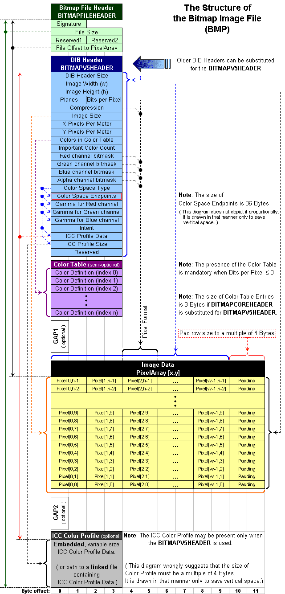

<!--more-->

## 1.1 介绍

&emsp;&emsp;图像处理涉及处理、修改已有的图像。第一步就是获取可读格式的图像。现在网络上有很多标准格式的图像。本章将介绍 TIFF 和 BMP 格式，并演示如何读写这些格式的图像。

&emsp;&emsp;若图像已经是可读格式的，图像处理软件就需要读取它，以供后续的处理和保存。本章提供了很多读取与保存的例程，后面我们将不再讨论这些细节。

&emsp;&emsp;（译者注：书中使用的图片格式较老，代码也比较难编译通过，建议可以使用 github 上的开源库 [stb](https://github.com/nothings/stb "https://github.com/nothings/stb")，我在后面）

## 1.2 图像数据基础

&emsp;&emsp;一张图片包括一个二维的数字矩阵，每个像素中的颜色或灰度取决于数组中对应元素的值。最简单的图像数据就是黑和白，对应于二值图片，每个像素不是0就是1.

&emsp;&emsp;下一种更复杂的图像数据是灰度，每个像素的取值在 0 和最大灰阶数或屏幕可显示的最大灰阶之间。这些图像看起来就像黑白照片，包含黑色、白色和不同深浅的灰色。大部分灰度图有 256 级灰阶。人眼可以分辨 40 级灰阶，所以 256 级的灰度图看起来就像照片。本书主要讨论的就是灰度图。

&emsp;&emsp;最复杂的图像数据是色彩。彩色图与灰度图类似，不过彩色图有三个通道（波段），对应红、绿、蓝。因此每个像素对应三个数字。彩色扫描仪就是用红、绿、蓝滤波器来获取这三个数字。

&emsp;&emsp;图片可以从网络、扫描仪、相机中获取。网络上的图片通常是 JPEG 格式，我们可以用一些软件转换成 TIFF 格式或 BMP 格式。

## 1.3 读写图像的要求

&emsp;&emsp;图像读写程序以一种隐藏内部细节的方式来读写图像。下面展示了程序员希望的过程：

```c
char  *in_name, *out_name;
short **the_image;
long  height, width;

create_image_file(in_name, out_name);
get_image_size(in_name, &height, &width);
the_image = allocate_image_array(height, width);
read_image_array(in_name, the_image);

    //call an image processing routine

write_image_array(out_name, the_image);
free_image_array(the_image, height);
```

&emsp;&emsp;前三行声明了基本的变量。然后创建图像文件，再获取图像的大小，以获取相应大小的内存空间。然后将图像读入内存，以进行后续的图像处理。处理完后将图像写入文件，最后释放内存空间。

&emsp;&emsp;上述过程是从顶层来描述，隐藏了图像文件的细节。文件读写则由底层的函数来做。这样可以提高代码的可移植性，减小对图像格式的要求。

## 1.4 TIFF

&emsp;&emsp;几家电脑公司与扫描仪公司创造了数字图像的工业标准，即 TIFF. 既然大多数电脑与扫描仪都支持这种格式，那么 TIFF 自然用于图像处理。

&emsp;&emsp;TIFF 标准的目标是可扩展性、携带性、可修改性，即 TIFF 在未来可进一步扩展，TIFF 必须适应新的图像类型，TIFF 必须可以在不同电脑中转移，TIFF 必须可修改。

&emsp;&emsp;TIFF 的全称是 Tag Image File Format，tag 指的是文件的基本结构。tag 中存的信息包含图片的长、宽，像素数量等。tag 统一存在 tag directories 中，tag directories 没有数量或大小的限制，多个 tag directories 用指针连接。这种灵活的图片的格式可以满足未来的需求。图 1.2 展示了目前标准的 tag. 图 1.3 展示了 TIFF 的结构。


&emsp;&emsp;最开始的 8 字节是 TIFF 头，这是 TIFF 文件中唯一固定的部分。其余部分在不同 TIFF 文件中都不同。IFD（Image File Directory）包括 Directory Entry 的数量，以及各个 Directory Entry. 而每个 Directory Entry 的结构见图 1.3 右侧，包括 tag，数据类型，数据长度和指向数据的指针（或数据本身）

&emsp;&emsp;Directory Entry 的数据类型见图 1.5


## 1.5 BMP

&emsp;&emsp;微软的 BMP 格式是 Windows 上常用的图像格式。BMP 比 TIFF 简单，它只是用来存储数字图像，虽然技术上来说不如 TIFF，但易于读写。

&emsp;&emsp;Windows 原生支持 BMP，有一大堆 Windows 软件支持这种格式。既然 BMP 是微软创造的，那么它只能支持因特尔处理器（译者注：现在AMD、arm等其它处理器也支持），也就是说，它是小端在前的（least significant byte first）。这与前面讨论的 TIFF 不同，TIFF 既可以小端在前，也可以大端在前。你可以用 Windows 自带的图片浏览程序来查看 BMP 图片。

&emsp;&emsp;BMP 格式有 6 种不同个版本，这里介绍的是 Windows 3.x 中使用的版本：每个像素 8 bits，灰色，无压缩。

&emsp;&emsp;BMP 文件包含（1）一个文件头（2）一个 bit map 头（3）一个色彩表（4）图片数据。文件头（见 Figure 1.6）占文件的前 14 字节。前 2 个字节始终是 `0x4D42`，即 `BM`；接着 4 个字节是 BMP 的大小；接着 2 个字节是 0；最后 4 个字节是图片数据的偏移量，这是个无符号数，指向数据开头。


&emsp;&emsp;紧接着的 40 字节（见 Figure 1.7）是 bit map 头。这是 BMP 3.x 版本独有的。bit map 头的第一部分是头的长度（即 40），接着是宽和高（即列数和行数），如果高是负数，则图片是从底部开始存储的。Color Planes（色位面数）通常是 1. Bits Per Pixel 指的是每个像素的位数。我的代码适用于每个像素 8 位，即 256 级灰度。


&emsp;&emsp;Compression 表示图片的压缩程度，0 表示无压缩，1 表示使用 length encoding 的压缩方式，我的代码仅支持无压缩。Size of Bitmap 表示压缩后的图像数据大小，如果没压缩，那么这个字段为 0.

&emsp;&emsp;后两个字段是图片的分辨率，而最后两个字段与颜色或灰度有关。纵向分辨率与横向分辨率的单位是 pixels per meter（每米的像素数）。Colors 字段则帮助软件解码色彩表，它表示图片中有多少种颜色或灰度。图片不一定有 256 种灰度，如果 Colors = 30，那么就只有 30 种灰度。这个字段表明了图片中重要的颜色/灰度有几种。

&emsp;&emsp;在 bit map 头之后的是色彩表。色彩表是一个查找表（lookup table），它将一种灰度或颜色与图片数据中的一个数对应起来。如果图片数据中某个像素等于 12，并不意味着它是第 12 级灰度，而有可能是 100 级或 200 级或其他，取决于色彩表中的对应关系。色彩表可以节省存储空间，但在图片处理中并不重要。

&emsp;&emsp;BMP 的颜色表的每个数对应 4 字节，前三个字节表示蓝、绿、红，第四个字节用于填充且始终是 0. 对于 256 级的灰度图，它的颜色表有 4x256 字节，并且蓝、绿、红的数值相等。

&emsp;&emsp;BMP 文件的最后一部分就是图片数据。数据按行来保存，并且每行后面有填充，填充后图片每一行都是 4 的倍数。这样可以更快的读取并追踪地址。

&emsp;&emsp;下图是对上面内容的总结（图来自维基百科）。



## 1.6 用 stb 库读取图片

&emsp;&emsp;（译者注：书中 1.6~1.8 分别讲的是测试程序、TIFF与BMP的转换、总结，但由于原书代码不可用，我将这几节替换为介绍 stb 的使用方法）

&emsp;&emsp;stb 是 github 上一个开源的 C 语言图像处理库（网址：[https://github.com/nothings/stb](https://github.com/nothings/stb)），它基于 MIT 协议，并且这个库的每类功能对应一个单独的 .h 文件，所以用起来十分方便。

&emsp;&emsp;我们只用到 stb 中的 `stb_image.h` 和 `stb_image_write.h`，所以你只需要到 github 上下载压缩包，然后提取出这个文件即可。另外，我们使用的图片是图像处理中经典的 lena 图片，你可以到 [https://www.ece.rice.edu/~wakin/images/](https://www.ece.rice.edu/~wakin/images/) 获取 .bmp 或 .jpg 文件。

&emsp;&emsp;在 `#include` 之前，需要定义 `STB_IMAGE_IMPLEMENTATION` 或 `STB_IMAGE_WRITE_IMPLEMENTATION`

```c
#include <stdio.h>
#include <stdlib.h>

#define STB_IMAGE_IMPLEMENTATION
#include "stb_image.h"
#define STB_IMAGE_WRITE_IMPLEMENTATION
#include "stb_image_write.h"

int main(void) {
    // ...
}
```

&emsp;&emsp;stb_image.h 中的 `stbi_load()` 函数可以读取常见的 jpg、png、bmp、gif 等图像，它接收的参数按顺序为路径、宽、高、通道数和要读取的通道数。最后一个参数可以取如下几个值：

* 0：表示读取图像所有的通道
* 1：读取灰度
* 2：读取灰度+透明度
* 3：读取 RGB
* 4：读取 RGB+透明度

&emsp;&emsp;如果读取成功，则会返回指向左上角的像素的指针，并且数据保存的顺序是从左到右一行一行往下；否则返回 NULL. 示例如下：

```c
int main(void) {
   int width, height, channels;
   unsigned char *img = stbi_load("lena.jpg", &width, &height, &channels, 0);
   if (img == NULL) {
      printf("Error in loading the image\n");
      exit(1);
   }
   printf("Loaded image with a width of %dpx, a height of %dpx and %d channels\n", width, height, channels);
}
```

编译时要用 `gcc -lm`，否则会显示 `undefined reference to 'pow'`，如果编译通过，上面的程序会输出：

```bash
Loaded image with a width of 512px, a height of 512px and 1 channels
```

由于 stb 读取的数据保存在一维数组中，我们需要将它转化为二维数组。可以用下面两种方法：

```c
/* 利用宏 */
#define B[(x)][(y)] A[((x*row)+(y%col))]

/* 利用循环 */
for(i=0;i<row;i++)
{
     for(j=0;j<col;j++)
     {
        B[i][j]=A[i*col+j];
     }
}
```

处理完后，我们可以用下面两个函数将数据保存为 jpg 或 png 图片。注意对于 jpg，最后一个参数的取值为 1~100，表示图片质量；对于 png，最后一个参数 stride_bytes = x*comp. 

```c
//save to jpg
int stbi_write_jpg(char const *filename, int x, int y, int comp, const void *data, int quality)

//save to png
int stbi_write_png(char const *filename, int x, int y, int comp, const void *data, int stride_bytes)
```

全部处理完后，记得释放内存：

```c
stbi_image_free(img);
```

今后我们将使用下面这个框架来进行实验：

```c
#include <stdio.h>
#include <stdlib.h>

#define STB_IMAGE_IMPLEMENTATION
#include "stb_image.h"
#define STB_IMAGE_WRITE_IMPLEMENTATION
#include "stb_image_write.h"

/* 将一维数据转化为二维数据 */
void resize_to_2D(unsigned char *img1D, unsigned char **img2D, int width, int height)
{
   for(int i=0;i<height;i++)
   {
      for(int j=0;j<width;j++)
      {
         img2D[i][j]=img1D[i*width+j];
      }
   }
}

/* 将二维数据转化为一维数据 */
void resize_to_1D(unsigned char *img1D, unsigned char **img2D, int width, int height)
{
   for(int i=0;i<height;i++)
   {
      for(int j=0;j<width;j++)
      {
         img1D[i*width+j]=img2D[i][j];
      }
   }
}

/* 主函数 */
int main(void) {
   /* 读取图像 */
   int width, height, channels;
   unsigned char *img = stbi_load("lena.jpg", &width, &height, &channels, 1);
   if (img == NULL)
   {
      printf("Error in loading the image\n");
      exit(1);
   }
   printf("Loaded image with a width of %dpx, a height of %dpx and %d channels\n", width, height, channels);

   /* 初始化二维指针 */
   unsigned char **in_img, **out_img;

   in_img = malloc(height * sizeof(unsigned char *));
   for (int i = 0; i < height; i++)
   {
      in_img[i] = malloc(width * sizeof(unsigned char));
      if (in_img[i] == NULL)
      {
         printf("\n\tmalloc of in_img[%d] failed", i);
      } /* ends if */
   }    /* ends loop over i */

   out_img = malloc(height * sizeof(unsigned char *));
   for (int i = 0; i < height; i++)
   {
      out_img[i] = malloc(width * sizeof(unsigned char));
      if (out_img[i] == NULL)
      {
         printf("\n\tmalloc of out_img[%d] failed", i);
      } /* ends if */
   }    /* ends loop over i */

   /* 将读取的一维数据转化为二维数据 */
   resize_to_2D(img, in_img, width, height);
   
   /* 
   进行图像处理
   */

   /* 将处理后的二维数据转化为一维数据 */
   resize_to_1D(img, out_img, width, height);
   
   /* 保存图像 */
   stbi_write_jpg("lean_ips.jpg", width, height, 1, img, 100);
   
   /* 释放内存空间 */
   stbi_image_free(img);
   for (int i = 0; i < height; i++)
   {
      free(in_img[i]);
      free(out_img[i]);
   }
}
```
